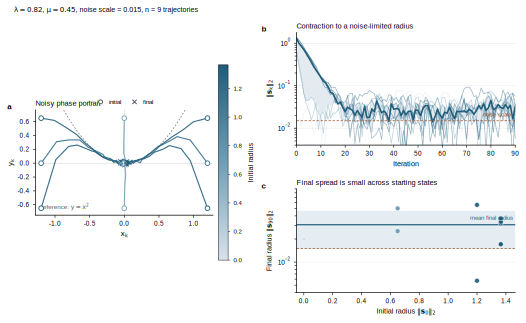
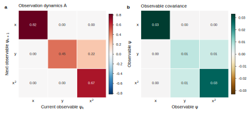
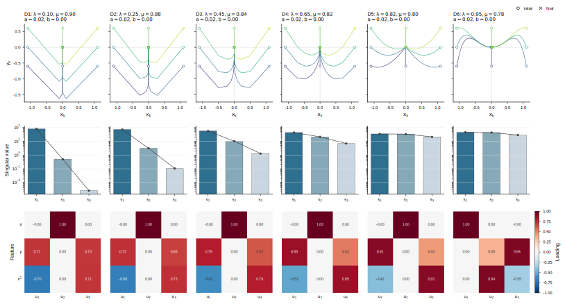
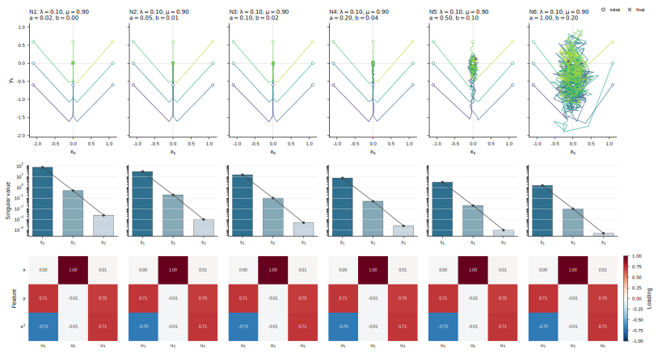

# 基于高斯迭代系统的因果涌现：面向随机非线性动力学的研究框架

## 目录

### 主文

- [1. 研究目标与核心转向](#sec-1)
- [2. 从随机非线性动力学到高斯迭代系统](#sec-2)
  - [2.1 动力学、时间尺度与观测函数](#sec-2-1)
  - [2.2 诱导的高斯迭代系统](#sec-2-2)
  - [2.3 分辨率、确定性极限与作用空间](#sec-2-3)
- [3. `GIS` 视角下的近似可逆性与因果涌现](#sec-3)
  - [3.1 线性高斯基准](#sec-3-1)
  - [3.2 `GIS` 指标的分解](#sec-3-2)
  - [3.3 宏观效率增益的定义](#sec-3-3)
- [4. 观测函数与粗粒化的基本原则](#sec-4)
  - [4.1 基于指定观测函数的因果涌现](#sec-4-1)
  - [4.2 合格粗粒化应满足的条件](#sec-4-2)
  - [4.3 当前框架下的分析流程](#sec-4-3)
- [5. 已知 ground truth 的验证案例](#sec-5)
  - [5.1 含噪抛物映射：动力学与观测层 ground truth](#sec-5-1)
  - [5.2 基础含噪轨迹与观测矩阵验证](#sec-5-2)
  - [5.3 反向精度矩阵的动力学扫描与噪声扫描](#sec-5-3)
- [6. 实验设计与判据](#sec-6)
  - [6.1 解析与半解析验证](#sec-6-1)
  - [6.2 数据驱动验证](#sec-6-2)
  - [6.3 时间尺度、噪声与分辨率扫描](#sec-6-3)
  - [6.4 成功与失败的判据](#sec-6-4)
- [7. 理论任务与开放问题](#sec-7)
- [8. 结论](#sec-8)
- [参考文献线索](#sec-ref)

### 附录

- [独立附录：研究框架附录](研究框架附录.md)
  - [附录 A. 为什么正文不再从 `TPM` 或白化谱出发](研究框架附录.md#app-a)
  - [附录 B. 当前 `Koopman` / 白化实现与本框架的关系](研究框架附录.md#app-b)
  - [附录 C. 统一符号表](研究框架附录.md#app-c)
  - [附录 D. GIS新实验](研究框架附录.md#app-d)

## 1. 研究目标与核心转向

本文要回答的问题是：对随机非线性动力学系统而言，是否存在某个比微观观测更低维、但在动态效率上更优的宏观表示。这里的“更优”不再先由离散 `TPM`、白化谱或某个特定 `Koopman` 对象来定义，而是直接落在一个给定观测空间中的有效随机动力学比较上。

基于这次讨论，正文采取如下核心转向：

1. 以随机非线性动力学和观测函数为起点，而不是以 `TPM` 或白化谱为起点；
2. 以观测空间中诱导出的高斯迭代系统（`GIS`）作为正文主对象；
3. 以确定性 `determinism`、非简并性`nondegeneracy`、维度平均效率与预测闭合性共同定义“宏观表示是否更好”；
4. 把 `Koopman` / 白化分析降到附录层，只保留其与历史实现对接和提供辅助诊断的角色。

因此，正文后续的基本叙事是：

1. 先给定时间尺度、分辨率和观测函数；
2. 再在该观测空间中拟合或近似一个有效 `GIS`；
3. 然后比较微观表示与候选宏观表示在该 `GIS` 下的动态效率；
4. 最后用已知 ground truth 的验证案例检验这一框架是否既能成功恢复正确宏观结构，也能在观测不充分时明确失败。

## 2. 从随机非线性动力学到高斯迭代系统

### 2.1 动力学、时间尺度与观测函数

时间尺度$\tau$下设离散时间随机非线性动力学在

$$
\mathbf{x}_{t+\tau} = \mathbf{F}_{\tau}\!\bigl(\mathbf{x}_t, \boldsymbol{\eta}^{(\tau)}_t\bigr),
\tag{2.1}
$$
由确定性映射$\mathbf{F}_{\tau}$与随机噪声$\eta_t$共同给出，其中 $\mathbf{x}_t \in \mathcal{X}$ 为底层状态变量，而$\boldsymbol{\eta}^{(\tau)}_t$汇总从 $t$ 到 $t+\tau$ 的随机扰动。$\tau =1,2,\cdots, t=0,1,2,\cdots.$ 这类模型我们们都可以把它看成是$t$时刻的状态$x_{t}$引起了$t+\tau$时刻的状态$x_{t+\tau}$的变化，因此$x_{t}$是因变量，而$x_{t+\tau}$是果变量。本文所讨论的因果专指如式（2.1）的动力系统中，在前后两个时刻状态变量彼此之间的因果效应强度。

与以往的研究Liu2024，Liu2025的操作不同，本文不直接把系统的状态变量$\mathbf{x}_t$等同于“用于判定因果涌现的微观态”。相反，我们先设定一个观测函数

$$
g : \mathcal{X} \to \mathbb{R}^m,
\qquad
\mathbf{o}_t := g(\mathbf{x}_t),
\tag{2.2}
$$
并把 $\mathbf{o}_t$ 所在空间视为当前分析中真正的微观表示空间。换言之，本文关注的并非底层状态变量本身，而是底层状态在给定观测函数下所对应的表征。通过选取一组观测函数作为基函数，并考察其在一次时间演化下的线性闭合关系，可以进一步刻画观测空间中变量在一步推进下的有效变换关系。因此，在本文的框架下因果模型则变为因此$\mathbf{o}_t$是因变量，而$\mathbf{o}_{t+\tau}$是果变量

### 2.2 诱导的高斯迭代系统

在给定 $g$ 与 $\tau$ 之后，我们把观测函数下的x动力学写为

$$
\mathbf{o}_{t+\tau} = \mathbf{H}_{\tau}(\mathbf{o}_t) + \boldsymbol{\varepsilon}^{(g,\tau)}_t,
\tag{2.3}
$$
其中 $\mathbf{H}_{\tau}$ 吸收了在该观测空间中可解释的系统演化，$\boldsymbol{\varepsilon}^{(g,\tau)}_t$ 吸收了剩余随机性、未建模非线性与有限分辨率误差。

正文采用的核心近似是：在给定观测函数、固定时间尺度和固定分辨率的条件下，用一个有效的高斯迭代系统来刻画该观测动力学，

$$
\mathbf{o}_{t+\tau}
\approx
\mathbf{A}^{(g,\tau)} \mathbf{o}_t + \boldsymbol{\varepsilon}^{(g,\tau)}_t,
\qquad
\boldsymbol{\varepsilon}^{(g,\tau)}_t \sim \mathcal{N}\!\bigl(\mathbf{0}, \boldsymbol{\Sigma}^{(g,\tau)}\bigr).
\tag{2.4}
$$
这一近似可从三个层面理解。首先，对于线性高斯系统，式（2.4）是严格成立的精确模型。其次，对于局部可线性化的随机非线性系统，式（2.4）可以看作在给定时间尺度和观测分辨率下的局部或有效近似。最后，对于一般的数据驱动系统，式（2.4）则可被视为选定观测空间中的经验代理模型，用于刻画变量之间的主导统计依赖结构。因此，正文真正要比较的对象是 $(\mathbf{A}^{(g,\tau)}, \boldsymbol{\Sigma}^{(g,\tau)})$ 在不同粗粒化下给出的动态效率，而不是某个先验规定好的谱对象。

<!-- 这里的解释分三层：

1. 对线性高斯系统，[式（2.4）](#eq-2-4) 是精确模型；
2. 对局部可线性化的随机非线性系统，[式（2.4）](#eq-2-4) 是局部或有效近似；
3. 对一般数据驱动系统，[式（2.4）](#eq-2-4) 是在选定观测空间中的经验代理模型。 -->

因此，正文真正要比较的对象是 $(\mathbf{A}^{(g,\tau)}, \boldsymbol{\Sigma}^{(g,\tau)})$ 在不同粗粒化下给出的动态效率，而不是某个先验规定好的谱对象。

### 2.3 分辨率、确定性极限与作用空间

进一步地，即使底层系统本身是确定性的，本文仍然允许在有限观测分辨率下引入一个与分辨率相关的有效噪声项。记分辨率参数为$\delta$，则观测空间中的动力学可进一步写为

$$
\mathbf{o}_{t+\tau}
\approx
\mathbf{A}^{(g,\tau,\delta)} \mathbf{o}_t + \boldsymbol{\varepsilon}^{(g,\tau,\delta)}_t,
\qquad
\boldsymbol{\varepsilon}^{(g,\tau,\delta)}_t \sim \mathcal{N}\!\bigl(\mathbf{0}, \boldsymbol{\Sigma}^{(g,\tau,\delta)}\bigr).
\tag{2.5}
$$
这里，$\delta$用以表征观测或状态划分的精细程度。$\delta$趋于更小意味着分辨率提高，此时由粗粒化、观测误差与未解析变量带来的不确定性通常减弱，相应地，$\boldsymbol{\Sigma}^{(g,\tau,\delta)}$可趋于零；而当$\delta$较大时，该协方差项则刻画由于有限分辨率、箱体划分以及隐藏自由度所引入的有效随机性。由此可见，即便底层动力学是确定性的，在有限分辨率下所得到的观测动力学仍然可以表现为随机迭代系统。

这一处理具有两层意义。首先，它为确定性系统与随机系统提供了统一的描述框架，使二者都可以纳入同一种有效动力学建模与因果分析之中。其次，它表明连续系统中的因果涌现并不是脱离观测条件而独立存在的性质，而是依赖于时间尺度、分辨率以及有效作用空间共同设定的结果。换言之，任何关于因果涌现的判断，都隐含着一个最小分辨率与有限分析窗口的前提。

基于这一认识，本文在后续讨论中默认采用如下设定。第一，系统的作用空间经过适当截断或有效限制，从而避免直接在无界状态空间上讨论相关数值算子。第二，分辨率参数$\delta$被视为模型设定的一部分，而非事后附加的技术修正。第三，时间尺度$\tau$也是需要显式选取和比较的参数，因为不同时间尺度对应不同的有效动力学结构，也可能对应不同层次的因果组织形式。

在上述设定下，本文的基本任务可以表述为：对于给定的观测函数$g$、时间尺度$\tau$和分辨率$\delta$，构造观测空间中的有效线性高斯迭代系统，并在此基础上分析其因果结构是否会在适当粗粒化之后得到增强。也就是说，本文关注的不是底层动力学是否“本体上”存在某种绝对的宏观因果层次，而是考察在给定观测与建模条件下，是否存在某一更高层次的有效描述，使得跨时间的因果作用具有更强的可辨识性与整体性。

<!--
当分辨率越来越细时，$\boldsymbol{\Sigma}^{(g,\tau,\delta)}$ 可以趋于零；当分辨率较粗时，它代表观测误差、箱体分辨率与未解析自由度所诱导的不确定性。这个视角有两点作用：

1. 它使确定性系统与随机系统能在同一叙事下处理；
2. 它提醒我们：连续系统里一切因果涌现结论都隐含最小分辨率与有限作用空间的假设。

因此，正文默认：

1. 作用空间经过截断或有效限制，不直接在无界空间上讨论数值算子；
2. 分辨率是模型设定的一部分，而不是事后补丁；
3. 时间尺度 $\tau$ 也是待选参数，而不是固定背景。
-->

## 3. `GIS` 视角下的近似可逆性与因果涌现

### 3.1 线性高斯基准

为得到可计算的基准，先考虑标准线性高斯迭代系统

$$
\mathbf{o}_{t+1} = \mathbf{A}\mathbf{o}_t + \boldsymbol{\varepsilon}_t,
\qquad
\boldsymbol{\varepsilon}_t \sim \mathcal{N}(\mathbf{0}, \boldsymbol{\Sigma}),
\qquad
\boldsymbol{\varepsilon}_t \perp \mathbf{o}_t.
\tag{3.1}
$$
这里，$\mathbf{A}$描述观测变量在一步时间推进中的有效线性传播，$\boldsymbol{\Sigma}$则表征在给定表示与分辨率下未被解释的随机扰动。因而，前向动力学的可预测性主要受$\boldsymbol{\Sigma}$控制：$\boldsymbol{\Sigma}$越小，给定当前状态后未来状态越集中，动力学越具有确定性。另一方面，从“由结果反推原因”的角度看，当前状态在未来中的可分辨程度不仅取决于噪声强弱，也取决于线性映射$\mathbf{A}$是否会压缩、混合或退化不同方向的信息；相应地，这一结构可由矩阵$\mathbf{A}^{\top}\boldsymbol{\Sigma}^{-1}\mathbf{A}$来表征。它刻画了未来状态对于当前状态不同方向的反向分辨能力：若某些方向在$\mathbf{A}$的作用下被显著压缩，或者被噪声淹没，则这些方向在后向上将变得难以区分。
沿用Liu2025文献一般高斯迭代系统中局部近似动力学可逆性的方法，本文把近似可逆性写成一个与下式同构的指标

$$
\Gamma_{\alpha}^{\mathrm{GIS}}(\mathbf{A}, \boldsymbol{\Sigma})
:=
\operatorname{pdet}\!\bigl(\mathbf{A}^{\top}\boldsymbol{\Sigma}^{-1}\mathbf{A}\bigr)^{\frac12-\frac{\alpha}{4}}
\operatorname{pdet}\!\bigl(\boldsymbol{\Sigma}^{-1}\bigr)^{\frac{\alpha}{4}},
\qquad
\alpha > 0,
\tag{3.2}
$$
其中 $\operatorname{pdet}$ 表示伪行列式。该量作为一个基准层上的动力学结构函数，综合了前向传播中的确定性与后向识别中的可分辨性，因此能够为不同表示层次之间的比较提供统一标尺。

若取对数，则

$$
\log \Gamma_{\alpha}^{\mathrm{GIS}}=
\left(\frac12-\frac{\alpha}{4}\right)
\log \operatorname{pdet}\!\bigl(\mathbf{A}^{\top}\boldsymbol{\Sigma}^{-1}\mathbf{A}\bigr)
+
\frac{\alpha}{4}
\log \operatorname{pdet}\!\bigl(\boldsymbol{\Sigma}^{-1}\bigr)
+ C_{\alpha},
\tag{3.3}
$$
其中 $C_{\alpha}$ 是与维数和归一化约定有关、但在固定比较中可并入常数项的部分。

需要强调的是，在本文框架中，引入$\Gamma_{\alpha}^{\mathrm{GIS}}$的目的，并不是单纯追求某个分数越大越好，而是要回答这样一个更本质的问题：在给定观测函数$g$、时间尺度 $\tau$与分辨率$\delta$的条件下，较低维的宏观表示能否以更少的自由度保留更多有效动力学结构，从而在单位维度意义上表现出更高的动态效率。 若答案是肯定的，那么这说明粗粒化并非只是压缩信息，而可能同时提升系统因果组织的有效表达能力。

因此，后续讨论中我们真正关心的，不是$\Gamma_{\alpha}^{\mathrm{GIS}}$的绝对大小，而是它在不同表示层次之间的归一化比较：当一个低维表示在维度归一化后优于原始高维表示时，我们便说该表示在当前观测—时间尺度—分辨率设定下具有更优的动力学组织效率，并据此进一步讨论宏观层次的出现条件。

### 3.2 `GIS` 指标的分解

与 Liu 2025一类似，$\Gamma_{\alpha}^{\mathrm{GIS}}$指标同样可以拆解为 determinism 与 nondegeneracy 两部分加以解释。需要强调的是，Liu 2025 直接讨论的是底层线性高斯状态变量上的动力学，而本文讨论的是在给定观测函数$g$之后，由底层系统在观测空间中诱导出的有效高斯迭代系统。因此，下文中的 determinism 与 nondegeneracy 均应理解为观测空间表征下的对应量，而非底层状态空间中的原始量。。

在略去与维数、归一化和常数项有关的部分后，本文定义观测空间中的 determinism 为

$$
D(\boldsymbol{\Sigma})
:=
\log \operatorname{pdet}\!\bigl(\boldsymbol{\Sigma}^{-1}\bigr),
\tag{3.4}
$$
本文定义观测空间中的 determinism 为

$$
N(\mathbf{A}, \boldsymbol{\Sigma})
:=
\log \operatorname{pdet}\!\bigl(\mathbf{A}^{\top}\boldsymbol{\Sigma}^{-1}\mathbf{A}\bigr).
\tag{3.5}
$$
这两个量分别对应前向动力学与后向辨识结构中的两个侧面。具体而言，$D(\boldsymbol{\Sigma})$由前向噪声协方差的逆矩阵 $\boldsymbol{\Sigma}^{-1}$决定，用来刻画在给定当前状态时未来状态分布的集中程度；噪声越小，$\boldsymbol{\Sigma}^{-1}$越大，$D(\boldsymbol{\Sigma})$也越大，表明系统的前向演化越具有确定性。相对地，$N(\mathbf{A},\boldsymbol{\Sigma})$由矩阵 $\mathbf{A}^{\top}\boldsymbol{\Sigma}^{-1}\mathbf{A}$决定，用来刻画未来状态对当前状态不同方向的区分能力；若不同原因方向经过动力学映射后仍能在未来中保持可分辨，则该量较大，说明系统的后向结构更不简并。

在此基础上，$\Gamma_{\alpha}^{\mathrm{GIS}}$可以看作对这两个方面的加权综合。取对数并略去无关常数后，其本质上是 $N(\mathbf{A},\boldsymbol{\Sigma})$与 $D(\boldsymbol{\Sigma})$的线性组合。当$\alpha\to 0$时，指标主要由
$N(\mathbf{A},\boldsymbol{\Sigma}) = \log \operatorname{pdet}\!\bigl(\mathbf{A}^{\top}\boldsymbol{\Sigma}^{-1}\mathbf{A}\bigr)$
主导，此时更强调后向动力学中的可分辨结构，因而对应 nondegeneracy；当$\alpha\to 2$时，指标主要由
$D(\boldsymbol{\Sigma}) = \log \operatorname{pdet}\!\bigl(\boldsymbol{\Sigma}^{-1}\bigr)$
主导，此时更强调前向动力学中的集中性与稳定性，因而对应 determinism。
在一般情形下，本文取$\Gamma^{\mathrm{GIS}}:=\Gamma_1^{\mathrm{GIS}}$即令$\alpha=1$。这一取值并不意味着两部分在数值上完全等权，而是表示在理论解释上同时兼顾前向确定性与后向非简并性，从而将二者作为观测空间有效动力学结构的两个互补侧面统一纳入同一指标之中。基于这种写法，后续无论讨论微观表示还是宏观表示，比较的都不再是单纯的噪声大小或单纯的映射秩，而是在给定观测函数、时间尺度与分辨率下，系统在观测空间中所体现出的综合动态组织能力。

于是[式（3.3）](#eq-3-3)可重写为

$$
\log \Gamma_{\alpha}^{\mathrm{GIS}}=
\left(\frac12-\frac{\alpha}{4}\right) N(\mathbf{A}, \boldsymbol{\Sigma})
+
\frac{\alpha}{4} D(\boldsymbol{\Sigma})
+
C_{\alpha}.
\tag{3.6}
$$
式（3.6）表明，GIS 意义下的近似可逆性本质上可以分解为两个互补部分：一部分来自后向动力学中的 nondegeneracy，另一部分来自前向动力学中的 determinism。前者衡量的是不同原因方向在经过动力学传播之后，是否仍能在结果中保持可区分性；后者衡量的则是在给定当前状态时，未来状态分布是否足够集中，从而体现出动力学的确定程度。就这一点而言，本文与 Liu 2025 的解释框架是一致的。不同之处仅在于：Liu 2025 讨论的是底层状态空间中的线性高斯系统，而本文讨论的是在给定观测函数$g$之后，由底层系统在观测空间中诱导出的有效 GIS。因而，这里的$D(\boldsymbol{\Sigma})$与$N(\mathbf{A},\boldsymbol{\Sigma})$都应理解为观测空间版本的 determinism 与 nondegeneracy。

这一分解也为后文的宏微比较提供了清晰的判断逻辑。若某个宏观表示相较于原有表示更优，那么这种优势并不必然只来自单一方面：它可能源于观测空间中 determinism 的提升，即宏观变量对未来演化具有更高的前向可预测性；也可能源于 nondegeneracy 的提升，即宏观变量在后向上保留了更强的原因可分辨性；当然，也可能同时来自二者的共同改善。换言之，宏观表示之所以可能优于微观表示，并不是因为“压缩”本身自动带来收益，而是因为适当的表示变换有可能在降低冗余的同时，提高单位维度上的有效动态组织能力。

### 3.3 宏观效率增益的定义

设微观观测为$\mathbf{o}_t \in \mathbb{R}^m$，给定粗粒化映射

$$
\boldsymbol{\phi} : \mathbb{R}^m \to \mathbb{R}^r,
\qquad
\mathbf{z}_t := \boldsymbol{\phi}(\mathbf{o}_t),
\qquad
r < m.
\tag{3.7}
$$

下，得到的宏观状态$\mathbf{z}_t\in\mathbb{R}^r$，其中$r < m$表示宏观空间的维度低于微观空间的维度。通过在宏观空间中拟合动态演化模型，我们得到

$$
\mathbf{z}_{t+\tau}\approx\mathbf{A}^{(\phi,\tau)} \mathbf{z}_t+
\boldsymbol{\varepsilon}^{(\phi,\tau)}_t,\qquad\boldsymbol{\varepsilon}^{(\phi,\tau)}_t
\sim\mathcal{N}\!\bigl(\mathbf{0}, \boldsymbol{\Sigma}^{(\phi,\tau)}\bigr).\tag{3.8}
$$

其中，$\mathbf{A}^{(\phi,\tau)}$为宏观空间中的线性转移矩阵，$\boldsymbol{\Sigma}^{(\phi,\tau)}$为宏观系统的协方差矩阵，$\boldsymbol{\varepsilon}^{(\phi,\tau)}_t$代表随机扰动。
为了进行跨维数的比较，定义维度平均近似可逆性为

$$
J_{\alpha}^{\mathrm{GIS}}(\mathbf{A}, \boldsymbol{\Sigma}; d)
:=
\frac{1}{d}\log \Gamma_{\alpha}^{\mathrm{GIS}}(\mathbf{A}, \boldsymbol{\Sigma}),
\tag{3.9}
$$
其中$d$是对应状态空间的维数，$\Gamma_{\alpha}^{\mathrm{GIS}}$如式（3.2）所定义。
基于此，宏观效率增益定义为

$$
\Delta J_{\alpha}^{(g,\phi,\tau)}
:=
J_{\alpha}^{\mathrm{GIS}}
\bigl(\mathbf{A}^{(\phi,\tau)}, \boldsymbol{\Sigma}^{(\phi,\tau)}; r\bigr)-
J_{\alpha}^{\mathrm{GIS}}
\bigl(\mathbf{A}^{(g,\tau)}, \boldsymbol{\Sigma}^{(g,\tau)}; m\bigr).
\tag{3.10}
$$
其中，$J_{\alpha}^{\mathrm{GIS}}$计算的是在不同维数下系统的近似可逆性，$\Delta J_{\alpha}^{(g,\phi,\tau)}$则量化了在粗粒化后宏观表示带来的动态效率增益。
若满足以下条件：
1.$\Delta J_{\alpha}^{(g,\phi,\tau)} > 0$，即粗粒化后宏观表示在单位维度上展现出更高的动态效率； 
2.宏观系统在一阶或多步预测中的误差未显著增加，保证了宏观预测的有效性； 
3.在所选时间尺度上，宏观动力学近似闭合，表明粗粒化后的系统在时间演化中保持一致性； 
则我们认为在给定观测函数$g$、粗粒化映射$\boldsymbol{\phi}$和时间尺度$\tau$下，系统发生了因果涌现。此时，因果涌现不仅表现为宏观表示相对于微观表示的有效性提升，而且进一步表明系统在特定观测条件和时间尺度下，能够通过粗粒化获得一种更具动态组织能力的高效描述。

## 4. 观测函数与粗粒化的基本原则

### 4.1 基于指定观测函数的因果涌现

在本文中，所有的因果涌现结论都必须明确写成“基于指定观测函数的因果涌现”。这一立场的依据在于，粗粒化并不是在真空中发生的过程。如果首先固定底层状态变量$\mathbf{x}_t$，然后确定观测函数$g$，再进一步选择粗粒化映射$\boldsymbol{\phi}$，那么最终被比较的对象为：

1. 微观表示 $\mathbf{o}_t = g(\mathbf{x}_t)$；
2. 宏观表示 $\mathbf{z}_t = \boldsymbol{\phi}(\mathbf{o}_t)$。
   
因此，本文不主张直接对比“底层状态空间上的有效信息（EI）”与“观测空间上的有效信息（EI）”。我们真正关心的是，在选定的表示空间内，哪种宏观化过程能够以更低的维度保持更高的动态效率。

### 4.2 合格粗粒化应满足的条件

一个候选粗粒化 $\boldsymbol{\phi}$ 至少应满足以下条件：

1. `信息性`：不能把决定未来演化的主导变量全部丢掉；
2. `低维性`：确实完成了压缩，而不是做同维重参数化；
3. `闭合性`：宏观动力学可由宏观当前状态近似预测；
4. `稳定性`：在不同样本窗口、随机种子和轻微参数扰动下保持可解释；
5. `可证伪性`：若观测函数本身丢失关键信息，框架应允许“分析失败”，而不是总给出一个看似合理的宏观变量。

其中，第五点尤为重要。一个成熟的理论框架不仅应在“观测函数选择得当”的情况下成功，还应在“观测函数明显不合适”的情况下明确给出失败的标志，而非强行推导出一个看似合理的宏观表示。

### 4.3 当前框架下的分析流程

在本框架下，我们建议的分析流程如下

1. 选定时间尺度 $\tau$、最小分辨率 $\delta$ 与作用空间；
2. 选定观测函数 $g$，得到微观表示 $\mathbf{o}_t$；
3. 在 $\mathbf{o}_t$ 上拟合微观 `GIS`，得到 $(\mathbf{A}^{(g,\tau)}, \boldsymbol{\Sigma}^{(g,\tau)})$；
4. 设计候选粗粒化 $\boldsymbol{\phi}$，得到 $\mathbf{z}_t$；
5. 在 $\mathbf{z}_t$ 上拟合宏观 `GIS`，得到 $(\mathbf{A}^{(\phi,\tau)}, \boldsymbol{\Sigma}^{(\phi,\tau)})$；
6. 比较 $D$、$N$、$J_{\alpha}^{\mathrm{GIS}}$、一阶预测误差、多步滚动误差与残差结构；
7. 对 $\tau$、$\delta$ 与噪声水平做扫描，检查结论是否稳健。

## 5. 已知 ground truth 的验证案例

本节把 `exp/analysitic/noisy_ana.ipynb` 中的含噪抛物映射实验纳入正文。这个实验的目的不是从经验数据中反推未知动力学，而是在一个解析结构完全已知的二维非线性系统中检查当前 `GIS` 框架的三个基本环节：

1. 给定合适观测函数时，观测空间中的一步映射矩阵是否能与解析 ground truth 对齐；
2. 吸引动力学在弱过程噪声下是否仍表现出可辨识的收缩结构；
3. 后向精度矩阵 $\boldsymbol{A}^{\top}\boldsymbol{\Sigma}^{-1}\boldsymbol{A}$ 的奇异谱是否真正反映确定性动力学结构，而不是被噪声强度本身误导。

### 5.1 含噪抛物映射：动力学与观测层 ground truth

微观状态为二维向量 $\boldsymbol{x}_k=(x_k,y_k)^{\top}$。实验使用的确定性骨架是抛物型离散映射

$$
x_{k+1}^{(0)}=\lambda x_k,
\qquad
y_{k+1}^{(0)}=\mu y_k+(\lambda^2-\mu)x_k^2.
\tag{5.1}
$$

过程噪声在确定性更新之后加入：

$$
\boldsymbol{x}_{k+1}
=
\begin{bmatrix}
x_{k+1}^{(0)}\\
y_{k+1}^{(0)}
\end{bmatrix}
{}+
\sigma_{\mathrm{proc}}\boldsymbol{\eta}_k,
\qquad
\boldsymbol{\eta}_k\sim\mathcal{N}(\boldsymbol{0},\boldsymbol{I}_2).
\tag{5.2}
$$

基础相图实验取 $\lambda=0.82$、$\mu=0.45$、$\sigma_{\mathrm{proc}}=0.015$，从 $x\in\{-1.2,0,1.2\}$、$y\in\{-0.65,0,0.65\}$ 的九个初值出发，模拟 $90$ 步。这个参数组满足 $|\lambda|<1$ 且 $|\mu|<1$，因此确定性骨架具有收缩性；噪声只在后期形成有限宽度的随机带。

观测函数选为

$$
\boldsymbol{\psi}(\boldsymbol{x})
=
\begin{bmatrix}
x\\
y\\
x^2
\end{bmatrix}.
\tag{5.3}
$$

在无噪声极限下，式 (5.1) 在该观测空间中是精确线性的：

$$
\boldsymbol{\psi}_{k+1}
=
\boldsymbol{A}\boldsymbol{\psi}_k,
\qquad
\boldsymbol{A}
=
\begin{bmatrix}
\lambda & 0 & 0\\
0 & \mu & \lambda^2-\mu\\
0 & 0 & \lambda^2
\end{bmatrix}.
\tag{5.4}
$$

因此，本案例的 ground truth 不是经验拟合结果，而是式 (5.4) 中的解析矩阵 $\boldsymbol{A}$。后续所有谱分析都围绕 $\boldsymbol{A}$、观测样本协方差或指定协方差 $\boldsymbol{\Sigma}$ 展开。

### 5.2 基础含噪轨迹与观测矩阵验证

图 5.1 展示基础含噪相图、半径衰减和终止半径对比。九条轨迹从较宽初值网格出发后均快速收缩到原点附近的噪声限制带。数值上，初始半径均值为 `1.0177`，终止半径均值降至 `0.0307`；最大终止半径为 `0.0557`，说明弱过程噪声不会破坏式 (5.1) 的整体吸引结构。

图 5.2 展示观测空间矩阵。左侧热图对应式 (5.4) 的解析矩阵 $\boldsymbol{A}$，其上三角结构清楚表达了 $x$、$y$ 与 $x^2$ 的依赖关系：$x$ 只依赖自身，$y$ 同时依赖 $y$ 与 $x^2$，而 $x^2$ 以 $\lambda^2$ 缩放。右侧热图是由模拟观测样本估计的协方差矩阵，它描述当前初值网格和过程噪声共同诱导的观测云形状。这个结果说明，选取 $\boldsymbol{\psi}=[x,y,x^2]^{\top}$ 后，非线性微观动力学可以被精确嵌入到三维线性 `GIS` 观测层。

### 5.3 反向精度矩阵的动力学扫描与噪声扫描

为了检查 $\boldsymbol{A}^{\top}\boldsymbol{\Sigma}^{-1}\boldsymbol{A}$ 的奇异谱究竟反映什么，本实验进一步构造两组参数网格。每一列都展示三类信息：相空间轨迹、$\boldsymbol{A}^{\top}\boldsymbol{\Sigma}^{-1}\boldsymbol{A}$ 的三个奇异值，以及左奇异向量在 $\boldsymbol{\psi}=[x,y,x^2]^{\top}$ 三个特征上的载荷。两组扫描都使用如下协方差族作为后向度量：

$$
\boldsymbol{\Sigma}
=
\begin{bmatrix}
a & 0 & b\\
0 & a & 0\\
b & 0 & a
\end{bmatrix}
=
a
\begin{bmatrix}
1 & 0 & \rho\\
0 & 1 & 0\\
\rho & 0 & 1
\end{bmatrix},
\qquad
\rho=\frac{b}{a},\quad a>0,\quad |\rho|<1 .
\tag{5.5}
$$

先不代入具体数值，而是直接分析这个谱问题。令 $c=\lambda^2-\mu$、$d=1-\rho^2$，并定义

$$
\boldsymbol{B}
:=
\boldsymbol{A}^{\top}\boldsymbol{\Sigma}^{-1}\boldsymbol{A}
=
\frac{1}{a}\boldsymbol{M},
\qquad
\boldsymbol{M}
=
\begin{bmatrix}
\lambda^2/d & 0 & -\rho\lambda^3/d\\
0 & \mu^2 & \mu c\\
-\rho\lambda^3/d & \mu c & c^2+\lambda^4/d
\end{bmatrix}.
\tag{5.6}
$$
由于 $\boldsymbol{B}$ 是实对称半正定矩阵，其奇异值就是特征值，左、右奇异向量也可以取为同一组正交特征向量；若出现重根，则对应子空间内的基向量不唯一。

把式 (5.6) 写成
\[
\boldsymbol{M}
=
\begin{bmatrix}
p & 0 & r\\
0 & q & t\\
r & t & h
\end{bmatrix},
\]
其中 $p=\lambda^2/d$、$q=\mu^2$、$r=-\rho\lambda^3/d$、$t=\mu c$、$h=c^2+\lambda^4/d$。则缩放后的奇异值 $\omega_i=a s_i$ 是三次方程

$$
\chi(\omega)
=
(p-\omega)\bigl[(q-\omega)(h-\omega)-t^2\bigr]
-r^2(q-\omega)
=0
\tag{5.7}
$$
的非负根。对任一使下式非零的单根 $\omega_i$，相应奇异向量可以显式写为

$$
\widetilde{\boldsymbol{u}}(\omega_i)
=
\begin{bmatrix}
-r(q-\omega_i)\\
-t(p-\omega_i)\\
(p-\omega_i)(q-\omega_i)
\end{bmatrix},
\qquad
\boldsymbol{u}_i
=
\frac{\widetilde{\boldsymbol{u}}(\omega_i)}
{\lVert\widetilde{\boldsymbol{u}}(\omega_i)\rVert_2},
\qquad
s_i=\frac{\omega_i}{a}.
\tag{5.8}
$$
式 (5.8) 只差一个整体符号；图中采用的符号约定是让绝对值最大的载荷为正。这个解析式已经说明：整体噪声尺度 $a$ 只把全部奇异值按 $1/a$ 缩放，并不改变奇异向量；奇异向量只依赖确定性参数 $(\lambda,\mu)$ 与协方差形状参数 $\rho=b/a$。

在第一组动力学扫描中，$b=0$，即 $\rho=0$。此时 $r=0$，$x$ 方向与 $(y,x^2)$ 子块完全解耦，解析解进一步化为

$$
\omega_x=\lambda^2,\qquad
\boldsymbol{u}_x=\boldsymbol{e}_x,
\qquad
\omega_{\pm}
=
\frac{q+h_0\pm\sqrt{(q-h_0)^2+4t^2}}{2},
\qquad
\boldsymbol{u}_{\pm}
=
\frac{(0,t,\omega_{\pm}-q)^{\top}}
{\sqrt{t^2+(\omega_{\pm}-q)^2}},
\tag{5.9}
$$
其中 $h_0=c^2+\lambda^4$。因此，$b=0$ 时数值奇异向量中必然出现一个纯 $x$ 方向，另外两个方向只在 $y$ 与 $x^2$ 平面内旋转。

第一组固定噪声结构与过程噪声，改变确定性动力学参数。具体地，协方差参数固定为 $a=0.02$、$b=0$，过程噪声固定为 $\sigma_{\mathrm{proc}}=0.0002$；同时令 $(\lambda,\mu)$ 从 $(0.10,0.90)$ 逐步变化到 $(0.95,0.78)$。图 5.3 显示，随着 $x$ 方向不再比其他方向快得多地消失，谱间隙迅速缩小：$s_1/s_2$ 从 D1 的约 `160.21` 降至 D5-D6 的约 `1.02-1.04`，$s_2/s_3$ 也从约 `197.80` 降至约 `1.51-1.60`。这说明清晰的一维截断并不是噪声参数强行制造的，而是来自确定性动力学中的快慢分离。

式 (5.9) 与图 5.3 的载荷图逐项一致。D1-D5 中，$\boldsymbol{u}_x=\boldsymbol{e}_x$ 对应第二个奇异向量；到 D6 时，$\lambda^2/a=45.125$ 已超过 $(y,x^2)$ 子块的最大奇异值约 `43.254`，所以纯 $x$ 方向变为第一个奇异向量。D1 的解析载荷为 $\boldsymbol{u}_+\approx(0,0.7110,-0.7032)^{\top}$、$\boldsymbol{u}_x=(1,0,0)^{\top}$、$\boldsymbol{u}_-\approx(0,0.7032,0.7110)^{\top}$，与数值图中的三列载荷相同。

第二组固定快慢动力学，专门改变噪声强度。确定性参数固定为 $\lambda=0.10$、$\mu=0.90$；后向精度矩阵使用式 (5.5) 的同一协方差形状，并固定 $\rho=b/a=0.2$。其中 $a$ 从 `0.02` 增至 `1.00`。为让相空间轨迹中的噪声差异可见，模拟过程噪声另按几何间隔从 `0.0002` 增至 `0.2`。这里需要区分两类噪声：式 (5.5) 的 $\boldsymbol{\Sigma}$ 决定后向精度矩阵的度量权重，而 $\sigma_{\mathrm{proc}}$ 只用于生成每列中可视化的随机轨迹。

图 5.4 的数值结论非常明确。随着 $a$ 增大，三个奇异值整体缩小，但相对比例几乎不变：$s_1/s_2$ 在 N1-N6 中恒为约 `153.78`，$s_2/s_3$ 恒为约 `206.12`，并且 $s_1a$ 恒为约 `1.60215`。左奇异向量载荷相对 N1 的最大变化仅为 `1.4e-10`，属于数值误差级别。式 (5.6)--(5.8) 给出的解析解释是：第二组实验只按比例放大 $\boldsymbol{\Sigma}$ 的整体强度，而不改变 $\rho$，所以 $\boldsymbol{\Sigma}^{-1}$ 只引入一个全局标量缩放，$\boldsymbol{A}^{\top}\boldsymbol{\Sigma}^{-1}\boldsymbol{A}$ 的方向结构保持不变。

进一步把 $\lambda=0.10$、$\mu=0.90$、$\rho=0.2$ 代入式 (5.8) 作为核对，可得
\[
\boldsymbol{u}_1\approx(0.000092,0.711023,-0.703169)^{\top},\quad
\boldsymbol{u}_2\approx(0.999898,-0.010113,-0.010095)^{\top},\quad
\boldsymbol{u}_3\approx(0.014288,0.703096,0.710951)^{\top}.
\]
这些载荷与图 5.4 中 N1-N6 的三列奇异向量一致；逐列比较解析式与数值 `SVD` 的最大载荷差约为 `1.4e-10`。因此，数值实验中的“噪声强度扫描不改变奇异向量”不是偶然现象，而是由式 (5.6) 中 $\boldsymbol{B}=a^{-1}\boldsymbol{M}$ 的解析结构直接推出。

这一点给出一个重要的解释边界：在“协方差形状固定、只改变整体噪声强度”的扫描中，噪声强弱只改变奇异谱的绝对尺度，不改变相对谱形和奇异向量方向。若要检验噪声是否会改变宏观方向，就不能只扫描 $a$ 的整体尺度，而应改变协方差结构，例如扫描 $b/a$、设置不同坐标的不同比例噪声，或引入状态相关噪声。

## 6. 实验设计与判据

### 6.1 解析与半解析验证

对第 5 节的验证案例，首要目标不是追求复杂模型，而是做可解释验证。最小实验集合包括：

1. 画出状态相图与样本轨道；
2. 在观测空间拟合微观 `GIS`；
3. 对候选宏观变量拟合宏观 `GIS`；
4. 比较微观与宏观的 $D$、$N$、$J_{\alpha}^{\mathrm{GIS}}$；
5. 比较 ground truth 宏观变量与恢复变量的相关性及其对应关系；
6. 比较一阶与多步预测误差。

在当前连续案例里，关键是“恢复变量是否与 $z_t^{\star}$ 单调对应”。

### 6.2 数据驱动验证

在解析案例通过后，再转向真实或半真实时间序列。此时正文建议沿用同一叙事：

1. 先选定观测函数；
2. 再在观测空间拟合有效 `GIS`；
3. 再比较宏微观效率。

对数据驱动系统，重点不再是“能否严格写出解析 `\mathbf{A}` 和 `\boldsymbol{\Sigma}`”，而是：

1. 估计得到的有效噪声协方差是否可解释；
2. 宏观变量是否稳定；
3. 时间尺度 $\tau$ 是否存在可解释的最优区间。

### 6.3 时间尺度、噪声与分辨率扫描

本文特别强调以下三种扫描：

1. `时间尺度扫描`：改变 $\tau$，观察 $\Delta J_{\alpha}$ 是否出现峰值；
2. `噪声扫描`：改变 $\boldsymbol{\Sigma}$ 或外加噪声水平，观察确定性与非简并性如何变化；
3. `分辨率扫描`：改变离散化、平滑尺度或最小箱体大小，检查结论是否稳健。

这三者都不应被当成实现细节，因为它们直接决定“宏观变量是否真的比微观变量更有效”。

### 6.4 成功与失败的判据

一个验证案例中，以下现象应被判为成功信号：

1. 在信息充分的观测函数下恢复出正确维数；
2. 恢复变量与 ground truth 宏观变量高度一致；
3. 宏观层的维度平均效率优于微观层；
4. 宏观预测误差不显著恶化；
5. 结果对小范围参数扰动具有稳健性。

相反，以下现象应被视为理论上有价值的失败：

1. 在信息被观测函数抹去时，框架无法恢复正确宏观结构；
2. 在不同 $\tau$ 下结论完全不稳；
3. 宏观效率提升只来自数值病态，而不伴随可解释的预测闭合性；
4. 恢复变量与 ground truth 宏观变量无清晰对应关系。

## 7. 理论任务与开放问题

在新的 `GIS` 主线下，后续最重要的理论任务包括：

1. 说明一般随机非线性系统在何种条件下可被局部或有效地写成[式（2.4）](#eq-2-4)；
2. 说明不同观测函数下的 `GIS` 参数如何变化，以及何时可比较；
3. 研究确定性极限下分辨率参数与有效噪声之间的定量关系；
4. 研究 $\tau$ 的最优选择是否可从 `GIS` 指标本身导出；
5. 研究连续宏变量与更一般混合宏观结构能否统一到同一判据下。

换言之，正文下一步的核心问题不再是“白化谱是否足够漂亮”，而是“在选定观测函数后，何时真的存在一个更高效的宏观随机动力学”。

## 8. 结论

本文将研究框架重写为 `GIS` 主线叙事。核心立场可以概括为：

1. 因果涌现首先是一个“给定观测函数后的动态效率比较”问题；
2. 对随机非线性系统而言，高斯迭代系统比白化谱对象更适合做正文理论起点；
3. 宏观变量是否合理，应通过确定性、非简并性、维度平均效率与预测闭合性共同判定；
4. 一个可信框架既要能在 ground truth 已知时成功恢复正确宏观结构，也要能在观测函数不合适时明确失败。

从这个角度看，本文后续真正要推进的不是“把因果涌现附会到某种 `Koopman` 技术上”，而是把随机非线性动力学中的宏微观效率比较，重写为一个以 `GIS` 为核心对象、以观测函数为前提、以可证伪验证案例为抓手的方法论。

## 参考文献线索

后续正式成文时，正文与附录应重点对接以下几类文献：

1. `GIS` 与线性高斯可逆性文献，用于支持[第 3 节](#sec-3)；
2. `EI-based CE` 与 `SVD-based CE` 文献，用于说明宏微观效率比较的历史背景；
3. `Koopman`、`EDMD`、`VAMP` 与 `TCCA` 文献，用于附录中说明与现有实现的关系；
4. 连续状态 `PF` / 连续 `TPM` 相关文献，用于支持分辨率、有限作用空间与连续极限讨论。
