# 基于高斯迭代系统的因果涌现：研究框架附录

[返回主文](研究框架.md)

## 目录

- [附录 A. 为什么正文不再从 `TPM` 或白化谱出发](#app-a)
- [附录 B. 当前 `Koopman` / 白化实现与本框架的关系](#app-b)
- [附录 C. 统一符号表](#app-c)
- [附录 D. GIS新实验](#app-d)
- [AI 实验交付文档标准](#ai-实验交付文档标准)
- [已知确定动力学解析解复现实验交付](#已知确定动力学解析解复现实验交付)
- [第三部分噪音强度扫描实验](#第三部分噪音强度扫描实验)

## 附录 A. 为什么正文不再从 `TPM` 或白化谱出发

对离散有限状态系统，`TPM` 是天然对象；但对连续随机非线性系统，若直接以 `TPM` 为起点，会立刻遇到三个先验选择：

1. 状态空间怎样离散化；
2. 最小分辨率取多大；
3. 观测函数究竟先于还是后于粗粒化。

类似地，若直接以白化谱对象为正文主角，也会把“如何选观测函数、如何定义噪声、如何处理时间尺度”这些更基础的问题藏到背景里。

因此，本文把 `GIS` 作为更基本的叙事层。`TPM`、`Koopman`、白化谱等对象都可以在特定离散化或特定实现中重新出现，但它们不再承担正文的理论起点角色。

## 附录 B. 当前 `Koopman` / 白化实现与本框架的关系

尽管正文不再从白化 `Koopman` 对象出发，现有实现中的相关量仍然有实用价值。若给定观测对 $(\mathbf{o}_t, \mathbf{o}_{t+\tau})$，则可定义经验二阶统计量

$$
\mathbf{C}_{00} = \mathbb{E}[\mathbf{o}_t \mathbf{o}_t^{\top}],
\qquad
\mathbf{C}_{01} = \mathbb{E}[\mathbf{o}_t \mathbf{o}_{t+\tau}^{\top}],
\qquad
\mathbf{C}_{11} = \mathbb{E}[\mathbf{o}_{t+\tau} \mathbf{o}_{t+\tau}^{\top}],
\tag{A.1}
$$
并构造原始回归矩阵

$$
\mathbf{K}_{\mathrm{raw}}
:=
\mathbf{C}_{00}^{\dagger}\mathbf{C}_{01},
\tag{A.2}
$$
以及双边白化矩阵

$$
\bar{\mathbf{K}}
:=
\mathbf{C}_{00}^{-1/2}\mathbf{C}_{01}\mathbf{C}_{11}^{-1/2}.
\tag{A.3}
$$

在旧框架里，[式（A.3）](#eq-a-3) 被当作正文主对象；而在本文的新框架里，它只承担三种补充角色：

1. 作为现有代码与历史实验的对接对象；
2. 作为观测空间几何与跨时相关结构的诊断工具；
3. 作为为候选宏观变量提供启发的辅助谱分析对象。

但是否存在因果涌现、宏观变量是否更优，正文不再由 $\bar{\mathbf{K}}$ 的谱直接定义，而是回到 `GIS` 量
$\mathbf{A}$、$\boldsymbol{\Sigma}$、$D$、$N$ 与 $J_{\alpha}^{\mathrm{GIS}}$ 上判断。

换言之，附录中的 `Koopman` / 白化分析可以继续存在，但它现在服务于正文主线，而不再替代正文主线。

## 附录 C. 统一符号表

本附录用于统一正文、附录与后续实验实现中会反复出现的符号。记号选择以正文 `GIS` 主线为主，同时兼容附录 B 中的 `Koopman` / 回归实现写法。若同一对象在不同语境下有“理论量 / 经验估计量”两种写法，则优先把无帽符号视为理论对象，把经验回归或样本估计视为其近似。

### C.1 时间、空间与基本对象

$t$离散时间索引，取值为 $t=0,1,2,\dots$。

$\tau$  时间尺度或时间步长，用于构造跨时样本对 $(\mathbf{x}_t,\mathbf{x}_{t+\tau})$、$(\mathbf{o}_t,\mathbf{o}_{t+\tau})$ 与 $(\mathbf{z}_t,\mathbf{z}_{t+\tau})$。

$\delta$  分辨率参数，统称观测、离散化、平滑、箱体大小、截断精度等所对应的“可分辨精细程度”。

$\mathcal{X}$ 原始状态空间。

$n$原始状态变量的维数。

$\mathbf{x}_t \in \mathbb{R}^n$原始状态变量，表示系统在时刻 $t$ 的底层状态。

$\mathbf{F}_{\tau}$原始系统在时间尺度 $\tau$ 下的动力学映射，满足
$$
\mathbf{x}_{t+\tau} = \mathbf{F}_{\tau}\!\bigl(\mathbf{x}_t,\boldsymbol{\eta}^{(\tau)}_t\bigr).
$$

$\boldsymbol{\eta}^{(\tau)}_t$原始动力学中的随机扰动总称，用于表示底层系统在时间尺度 $\tau$ 上累积的噪声或未建模扰动。

### C.2 观测层与宏观层表示

$g : \mathcal{X} \to \mathbb{R}^m$观测函数，把原始状态映射到观测空间。

$m$观测层微观表示的维数。

$\mathbf{o}_t = g(\mathbf{x}_t) \in \mathbb{R}^m$观测层微观表示。正文中的“微观层”默认指观测之后的表示层，而非原始状态变量本身。

$\boldsymbol{\phi} : \mathbb{R}^m \to \mathbb{R}^r$粗粒化函数或宏观映射，把观测层微观表示映射到宏观表示。

$r$宏观表示的维数，通常满足 $r < m$。该量既可以外生给定，也可以由奇异值谱、谱间隙、有效秩或阈值准则内生确定。

$\mathbf{z}_t = \boldsymbol{\phi}(\mathbf{o}_t) \in \mathbb{R}^r$宏观表示或宏观变量。

$\mathbf{W} \in \mathbb{R}^{r\times m}$线性粗粒化矩阵。当粗粒化函数取线性形式时，
$$
\mathbf{z}_t = \boldsymbol{\phi}(\mathbf{o}_t) = \mathbf{W}\mathbf{o}_t.
$$
因此，$\mathbf{W}$ 可视为粗粒化函数 $\boldsymbol{\phi}$ 的矩阵化参数。在当前工作的完整两步 SVD 路线中，$\mathbf{W}$ 不是直接由单个矩阵的左奇异向量给出，而是由 $\boldsymbol{\Sigma}^{-1}$ 与 $\mathbf{A}^{\top}\boldsymbol{\Sigma}^{-1}\mathbf{A}$ 的两类主方向在统一排序、截断并再次分解之后共同确定。

### C.3 `GIS` 动力学、噪声与残差

$d$当前表示层的维数统一记号。若讨论观测层，则 $d=m$；若讨论宏观层，则 $d=r$。

$\mathbf{A}\in\mathbb{R}^{d\times d}$当前表示层上的有效动力学矩阵。在统一写法下，
$$
\mathbf{y}_{t+\tau} \approx \mathbf{A}\mathbf{y}_t + \boldsymbol{\varepsilon}_t,
$$
其中 $\mathbf{y}_t$ 可代表 $\mathbf{o}_t$ 或 $\mathbf{z}_t$。

$\boldsymbol{\Sigma}\in\mathbb{R}^{d\times d}$当前表示层上的有效噪声协方差矩阵，对应于噪声项 $\boldsymbol{\varepsilon}_t$ 的协方差。

$\boldsymbol{\varepsilon}_t$当前表示层上的有效噪声项总称，吸收未建模非线性、有限分辨率误差、观测噪声与隐藏自由度所诱导的随机性。

$\mathbf{A}_o \in \mathbb{R}^{m\times m}$观测层微观 `GIS` 的动力学矩阵，满足
$$
\mathbf{o}_{t+\tau}\approx \mathbf{A}_o\mathbf{o}_t + \boldsymbol{\varepsilon}^{(o)}_t.
$$

$\boldsymbol{\Sigma}_o \in \mathbb{R}^{m\times m}$观测层微观噪声协方差矩阵，即 $\boldsymbol{\varepsilon}^{(o)}_t$ 的协方差。

$\boldsymbol{\varepsilon}^{(o)}_t$观测层微观残差或噪声项。

$\mathbf{e}^{(o)}_t := \mathbf{o}_{t+\tau} - \mathbf{A}_o\mathbf{o}_t$观测层一步预测残差。数据驱动情形下，通常用其样本协方差估计 $\boldsymbol{\Sigma}_o$。

在“已知确定动力学解析解复现”这类验证实验中，$\mathbf{A}_o$ 可直接由解析动力学给定；若噪音首先加在原始状态层，则观测层协方差矩阵可由
$$
\boldsymbol{\Sigma}_o = \mathrm{Cov}\!\bigl(\mathbf{o}_t^{\mathrm{noisy}} - \mathbf{o}_t^{\mathrm{clean}}\bigr)
$$
直接构造，而不必再通过残差回归估计。

$\mathbf{A}_z \in \mathbb{R}^{r\times r}$宏观层 `GIS` 的动力学矩阵，满足
$$
\mathbf{z}_{t+\tau}\approx \mathbf{A}_z\mathbf{z}_t + \boldsymbol{\varepsilon}^{(z)}_t.
$$

$\boldsymbol{\Sigma}_z \in \mathbb{R}^{r\times r}$宏观层噪声协方差矩阵，即 $\boldsymbol{\varepsilon}^{(z)}_t$ 的协方差。

$\boldsymbol{\varepsilon}^{(z)}_t$宏观层残差或噪声项。

$\mathbf{e}^{(z)}_t := \mathbf{z}_{t+\tau} - \mathbf{A}_z\mathbf{z}_t$宏观层一步预测残差。数据驱动情形下，通常用其样本协方差估计 $\boldsymbol{\Sigma}_z$。

### C.4 经验二阶统计量与 `Koopman` / 回归实现

$\mathbf{C}_{00}$观测层当前时刻自协方差矩阵，
$$
\mathbf{C}_{00} = \mathbb{E}[\mathbf{o}_t\mathbf{o}_t^\top].
$$

$\mathbf{C}_{01}$观测层跨时协方差矩阵，
$$
\mathbf{C}_{01} = \mathbb{E}[\mathbf{o}_t\mathbf{o}_{t+\tau}^\top].
$$

$\mathbf{C}_{11}$未来时刻自协方差矩阵，
$$
\mathbf{C}_{11} = \mathbb{E}[\mathbf{o}_{t+\tau}\mathbf{o}_{t+\tau}^\top].
$$

$\mathbf{K}_{\mathrm{raw}}$观测层经验动力学矩阵，
$$
\mathbf{K}_{\mathrm{raw}} := \mathbf{C}_{00}^{\dagger}\mathbf{C}_{01}.
$$
在数据驱动、线性近似与最小二乘回归语境下，可把它视为观测层有效动力学矩阵 $\mathbf{A}_o$ 的经验估计，即
$$
\mathbf{A}_o \approx \mathbf{K}_{\mathrm{raw}}.
$$
它更准确地说是观测空间中的经验线性传播矩阵，而不直接等同于底层系统的真实雅可比矩阵。

$\bar{\mathbf{K}}$双边白化后的经验动力学矩阵，
$$
\bar{\mathbf{K}}
:=
\mathbf{C}_{00}^{-1/2}\mathbf{C}_{01}\mathbf{C}_{11}^{-1/2}.
$$
在当前框架中，它主要作为辅助诊断对象，而不是正文中判定因果涌现的直接定义对象。

$\hat{\mathbf{A}}, \hat{\boldsymbol{\Sigma}}$动力学矩阵与协方差矩阵的经验估计量。若需显式区分理论量与样本估计量，可用帽子记号表示估计值。

### C.5 可逆性、效率与因果涌现指标

$\operatorname{pdet}(\cdot)$伪行列式。对奇异矩阵也可定义；当矩阵满秩时，它退化为普通行列式。

$\Gamma_{\alpha}^{\mathrm{GIS}}(\mathbf{A},\boldsymbol{\Sigma})$`GIS` 近似可逆性，综合前向确定性与后向可分辨性。它是当前框架中的核心动力学结构量。

$\log \Gamma_{\alpha}^{\mathrm{GIS}}(\mathbf{A},\boldsymbol{\Sigma})$对数近似可逆性，便于加法分解、跨层比较与维度归一化。

$\alpha$近似可逆性中的权重参数，用于控制 determinism 与 nondegeneracy 的相对权重。正文默认可取 $\alpha=1$。

$D(\boldsymbol{\Sigma})=\log \operatorname{pdet}(\boldsymbol{\Sigma}^{-1})$确定性，用于度量给定当前状态后未来状态分布的集中程度。

$N(\mathbf{A},\boldsymbol{\Sigma})=\log \operatorname{pdet}(\mathbf{A}^{\top}\boldsymbol{\Sigma}^{-1}\mathbf{A})$非简并性，用于度量不同原因方向在未来中是否仍保持可区分。

$J_{\alpha}^{\mathrm{GIS}}(\mathbf{A},\boldsymbol{\Sigma};d):=\frac{1}{d}\log \Gamma_{\alpha}^{\mathrm{GIS}}(\mathbf{A},\boldsymbol{\Sigma})$维度平均效率，也可理解为维度归一化近似可逆性。

$J_{\alpha,o}:=J_{\alpha}^{\mathrm{GIS}}(\mathbf{A}_o,\boldsymbol{\Sigma}_o;m)$观测层微观维度平均效率。

$J_{\alpha,z}:=J_{\alpha}^{\mathrm{GIS}}(\mathbf{A}_z,\boldsymbol{\Sigma}_z;r)$宏观层维度平均效率。

$\Delta J_{\alpha}:=J_{\alpha,z} - J_{\alpha,o}$宏观效率增益。若需把“因果涌现强度”记为单独符号，则本文建议直接约定
$$
\mathrm{CE} := \Delta J_{\alpha}.
$$
在此约定下，`CE` 不是单独新增的一类量，而是宏观层相对微观层的维度平均效率提升。

### C.6 预测量与误差量

$\hat{\mathbf{o}}_{t+\tau \mid t}$观测层单步预测值。在线性 `GIS` 下，
$$
\hat{\mathbf{o}}_{t+\tau \mid t} = \mathbf{A}_o \mathbf{o}_t.
$$

$\hat{\mathbf{z}}_{t+\tau \mid t}$宏观层单步预测值。在线性 `GIS` 下，
$$
\hat{\mathbf{z}}_{t+\tau \mid t} = \mathbf{A}_z \mathbf{z}_t.
$$

$\hat{\mathbf{o}}_{t+k\tau \mid t}$观测层多步滚动预测值。在线性 `GIS` 下，
$$
\hat{\mathbf{o}}_{t+k\tau \mid t} = \mathbf{A}_o^k \mathbf{o}_t.
$$

$\hat{\mathbf{z}}_{t+k\tau \mid t}$宏观层多步滚动预测值。在线性 `GIS` 下，
$$
\hat{\mathbf{z}}_{t+k\tau \mid t} = \mathbf{A}_z^k \mathbf{z}_t.
$$

$E_1^{(o)}$观测层单步预测误差，例如可定义为
$$
E_1^{(o)} := \frac{1}{T}\sum_t \|\mathbf{o}_{t+\tau} - \mathbf{A}_o\mathbf{o}_t\|^2.
$$

$E_k^{(o)}$观测层 $k$ 步滚动误差，例如可定义为
$$
E_k^{(o)} := \frac{1}{T}\sum_t \|\mathbf{o}_{t+k\tau} - \mathbf{A}_o^k\mathbf{o}_t\|^2.
$$

$E_1^{(z)}$宏观层单步预测误差，例如可定义为
$$
E_1^{(z)} := \frac{1}{T}\sum_t \|\mathbf{z}_{t+\tau} - \mathbf{A}_z\mathbf{z}_t\|^2.
$$

$E_k^{(z)}$宏观层 $k$ 步滚动误差，例如可定义为
$$
E_k^{(z)} := \frac{1}{T}\sum_t \|\mathbf{z}_{t+k\tau} - \mathbf{A}_z^k\mathbf{z}_t\|^2.
$$

$T$样本数，用于经验协方差、经验误差以及回归量的估计。

### C.7 SVD 相关记号

$s_i$矩阵 $\mathbf{A}^{\top}\boldsymbol{\Sigma}^{-1}\mathbf{A}$ 的奇异值，用于表征后向可分辨结构。

$\kappa_i$矩阵 $\boldsymbol{\Sigma}^{-1}$ 的奇异值，用于表征前向确定性结构。

$\epsilon$奇异值截断阈值。在基于 SVD 的宏观变量提取中，它用于区分应保留的主方向与应截断的冗余方向。

$r_{\epsilon}$由阈值 $\epsilon$ 得到的有效秩，可作为宏观维度 $r$ 的候选自动选取准则。

$\mathbf{U}, \mathbf{S}, \mathbf{V}$SVD 分解中的矩阵记号。若某矩阵分解为
$$
\mathbf{M} = \mathbf{U}\mathbf{S}\mathbf{V}^{\top},
$$
则 $\mathbf{U}$ 与 $\mathbf{V}$ 分别表示左右奇异向量矩阵，$\mathbf{S}$ 为奇异值对角矩阵。

$\mathbf{U}_{\mathrm{det}}, \mathbf{S}_{\mathrm{det}}$表示对 $\boldsymbol{\Sigma}^{-1}$ 做 SVD 后得到的左奇异向量矩阵与奇异值矩阵，用于表征确定性方向。

$\mathbf{U}_{\mathrm{non\text{-}deg}}, \mathbf{S}_{\mathrm{non\text{-}deg}}$表示对 $\mathbf{A}^{\top}\boldsymbol{\Sigma}^{-1}\mathbf{A}$ 做 SVD 后得到的左奇异向量矩阵与奇异值矩阵，用于表征非简并性方向。

$\mathbf{S}_{\mathrm{all}}$表示将 $\mathbf{S}_{\mathrm{det}}$ 与 $\mathbf{S}_{\mathrm{non\text{-}deg}}$ 合并并按降序重新排列之后得到的统一奇异值集合。

$\bar{\mathbf{U}}, \bar{\mathbf{S}}$表示对 $\mathbf{S}_{\mathrm{all}}$ 按阈值 $\epsilon$ 做第一次截断后保留下来的方向矩阵与奇异值矩阵。

$\mathbf{U}_2, \mathbf{S}_2$表示对加权组合矩阵
$$
\bar{\mathbf{U}}\bar{\mathbf{S}}
$$
再次做 SVD 后得到的左奇异向量矩阵与奇异值矩阵。

在当前实现路线中，粗粒化矩阵 $\mathbf{W}$ 优先由完整两步 SVD 结果构造得到。其最终形式可写为
$$
\mathbf{W} = \bar{\mathbf{U}}_2^{\top},
$$
其中 $\bar{\mathbf{U}}_2$ 表示对第二次分解结果按阈值 $\epsilon$ 或手动给定维度 $r$ 截断后保留下来的主方向矩阵。

## 附录 D. GIS新实验

本附录给出在“只知道数据”或“以数据为主”的情形下，基于 `GIS` 主线进行宏微观效率比较的统一流程。整体思路是：先在观测层建立微观 `GIS`，再构造宏观表示并建立宏观 `GIS`，最后通过动态效率与预测表现的比较来判断是否出现因果涌现。

### D.1 数据准备

首先准备原始时间序列数据。若已有实验数据，则需将其整理为统一格式的时间序列
$$
\{\mathbf{x}_t\}_{t=0}^{T},
\qquad
\mathbf{x}_t \in \mathbb{R}^n.
$$
若没有现成数据，也可以从给定动力学模型出发，直接生成带噪或不带噪的模拟数据。此时原始系统可写为
$$
\mathbf{x}_{t+\tau} = \mathbf{F}_{\tau}\!\bigl(\mathbf{x}_t,\boldsymbol{\eta}_t^{(\tau)}\bigr).
$$
这一步的目标，是得到后续所有分析所依赖的原始状态序列，并保证其时间顺序、维数与采样方式一致。

输入：原始实验数据或仿真模型。  
输出：标准化后的原始时间序列 $\{\mathbf{x}_t\}$。

### D.2 选定观测函数、时间尺度与分辨率，得到观测层数据

在原始状态序列之上，选定观测函数 $g$、时间尺度 $\tau$ 与分辨率参数 $\delta$。观测函数把原始状态映射到观测空间：
$$
g : \mathcal{X} \to \mathbb{R}^m,
\qquad
\mathbf{o}_t = g(\mathbf{x}_t).
$$
于是得到观测层微观表示序列 $\{\mathbf{o}_t\}$。同时，根据时间尺度 $\tau$，构造跨时样本对
$$
(\mathbf{o}_t,\mathbf{o}_{t+\tau}).
$$
这一步的作用，是把原始数据转化为真正参与微观层分析的观测表示，并明确分析所依赖的时间尺度与分辨率条件。

输入：$\{\mathbf{x}_t\}$、$g$、$\tau$、$\delta$。  
输出：观测层数据 $\{\mathbf{o}_t\}$ 及其跨时样本对 $(\mathbf{o}_t,\mathbf{o}_{t+\tau})$。

### D.3 拟合微观 `GIS`，得到微观动力学矩阵与协方差矩阵

在观测层上，利用样本对 $(\mathbf{o}_t,\mathbf{o}_{t+\tau})$ 拟合微观 `GIS`
$$
\mathbf{o}_{t+\tau} \approx \mathbf{A}_o \mathbf{o}_t + \boldsymbol{\varepsilon}_t^{(o)}.
$$
若采用二阶统计量写法，可定义
$$
\mathbf{C}_{00} = \mathbb{E}[\mathbf{o}_t \mathbf{o}_t^\top],
\qquad
\mathbf{C}_{01} = \mathbb{E}[\mathbf{o}_t \mathbf{o}_{t+\tau}^\top],
\qquad
\mathbf{C}_{11} = \mathbb{E}[\mathbf{o}_{t+\tau} \mathbf{o}_{t+\tau}^\top],
$$
并构造经验回归矩阵
$$
\mathbf{K}_{\mathrm{raw}} = \mathbf{C}_{00}^{\dagger}\mathbf{C}_{01}.
$$
在数据驱动语境下，可把它视为微观动力学矩阵 $\mathbf{A}_o$ 的经验估计，即
$$
\mathbf{A}_o \approx \mathbf{K}_{\mathrm{raw}}.
$$
随后计算一步残差
$$
\mathbf{e}_t^{(o)} := \mathbf{o}_{t+\tau} - \mathbf{A}_o\mathbf{o}_t,
$$
并用其样本协方差估计微观噪声协方差矩阵
$$
\boldsymbol{\Sigma}_o = \mathrm{Cov}(\mathbf{e}_t^{(o)}).
$$
这一步的核心，是在观测层上建立一个有效的线性高斯近似模型，为后续预测、指标计算与宏观构造提供基础。

输入：$(\mathbf{o}_t,\mathbf{o}_{t+\tau})$；在解析验证实验中，也可直接输入真值 $\mathbf{A}_o$ 与观测层协方差矩阵 $\boldsymbol{\Sigma}_o$。  
输出：$\mathbf{A}_o$、$\boldsymbol{\Sigma}_o$、$\mathbf{e}_t^{(o)}$ 或其真值版本。

### D.4 进行微观层单步与多步预测，并计算误差

得到微观 `GIS` 后，可在观测层进行预测。单步预测为
$$
\hat{\mathbf{o}}_{t+\tau \mid t} = \mathbf{A}_o \mathbf{o}_t,
$$
多步滚动预测为
$$
\hat{\mathbf{o}}_{t+k\tau \mid t} = \mathbf{A}_o^k \mathbf{o}_t.
$$
相应地，可定义微观层单步误差与多步滚动误差。例如，
$$
E_1^{(o)} = \frac{1}{T}\sum_t \|\mathbf{o}_{t+\tau} - \mathbf{A}_o \mathbf{o}_t\|^2,
$$
$$
E_k^{(o)} = \frac{1}{T}\sum_t \|\mathbf{o}_{t+k\tau} - \mathbf{A}_o^k \mathbf{o}_t\|^2.
$$
这一步的目标，是检验观测层有效 `GIS` 的预测能力与闭合程度，为后续宏微比较提供基线。若需保留逐样本误差序列，可进一步记
$$
e_{1,t}^{(o)} := \|\mathbf{o}_{t+\tau} - \mathbf{A}_o \mathbf{o}_t\|^2,
\qquad
e_{k,t}^{(o)} := \|\mathbf{o}_{t+k\tau} - \mathbf{A}_o^k \mathbf{o}_t\|^2,
$$
其中小写 $e$ 表示逐样本误差，大写 $E$ 表示汇总后的平均误差。

输入：$\mathbf{A}_o$、$\{\mathbf{o}_t\}$。  
输出：微观单步预测、多步预测及其误差 $E_1^{(o)}, E_k^{(o)}$。

### D.5 计算微观层动力学结构指标

在微观层，基于 $(\mathbf{A}_o,\boldsymbol{\Sigma}_o)$ 计算动态效率相关指标。核心量包括：

近似可逆性
$$
\Gamma_{\alpha}^{\mathrm{GIS}}(\mathbf{A}_o,\boldsymbol{\Sigma}_o),
$$

对数近似可逆性
$$
\log \Gamma_{\alpha}^{\mathrm{GIS}}(\mathbf{A}_o,\boldsymbol{\Sigma}_o),
$$

确定性
$$
D(\boldsymbol{\Sigma}_o)=\log \operatorname{pdet}(\boldsymbol{\Sigma}_o^{-1}),
$$

非简并性
$$
N(\mathbf{A}_o,\boldsymbol{\Sigma}_o)=\log \operatorname{pdet}(\mathbf{A}_o^\top \boldsymbol{\Sigma}_o^{-1}\mathbf{A}_o),
$$

以及维度平均效率

$$
J_{\alpha,o}:=J_{\alpha}^{\mathrm{GIS}}(\mathbf{A}_o,\boldsymbol{\Sigma}_o;m)=\frac{1}{m}\log \Gamma_{\alpha}^{\mathrm{GIS}}(\mathbf{A}_o,\boldsymbol{\Sigma}_o).
$$

这一步的作用，是从前向可预测性与后向可分辨性两方面刻画微观观测层的动态组织能力。

输入：$\mathbf{A}_o$、$\boldsymbol{\Sigma}_o$、维数 $m$。  
输出：微观层的 $\Gamma$、$\log\Gamma$、$D$、$N$、$J_{\alpha,o}$。

### D.6 确定宏观维度，并构造粗粒化函数与粗粒化矩阵

在微观层分析完成后，需要确定宏观维度 $r$，并据此构造粗粒化函数 $\boldsymbol{\phi}$ 或线性粗粒化矩阵 $\mathbf{W}$。此时宏观表示写为
$$
\mathbf{z}_t = \boldsymbol{\phi}(\mathbf{o}_t),
\qquad
\text{或在线性情形下}
\qquad
\mathbf{z}_t = \mathbf{W}\mathbf{o}_t.
$$
宏观维度 $r$ 可以由外生方式给定，也可以依据奇异值谱、谱间隙、有效秩或阈值 $\epsilon$ 内生确定。若采用当前的完整两步 SVD 路线，则通常基于
$$
\boldsymbol{\Sigma}_o^{-1}
\qquad\text{与}\qquad
\mathbf{A}_o^\top \boldsymbol{\Sigma}_o^{-1}\mathbf{A}_o
$$
的奇异值结构构造 $\mathbf{W}$。更具体地说，可按如下步骤进行：

1. 分别对
$$
\boldsymbol{\Sigma}_o^{-1}
\qquad \text{和} \qquad
\mathbf{A}_o^\top \boldsymbol{\Sigma}_o^{-1}\mathbf{A}_o
$$
做 SVD，得到 $\mathbf{U}_{\mathrm{det}}, \mathbf{S}_{\mathrm{det}}$ 与 $\mathbf{U}_{\mathrm{non\text{-}deg}}, \mathbf{S}_{\mathrm{non\text{-}deg}}$。

2. 将两组奇异值合并并按降序排序，得到 $\mathbf{S}_{\mathrm{all}}$，同时同步重排对应的奇异向量。

3. 按阈值 $\epsilon$ 对 $\mathbf{S}_{\mathrm{all}}$ 做第一次截断，得到 $\bar{\mathbf{U}}, \bar{\mathbf{S}}$。

4. 对
$$
\bar{\mathbf{U}}\bar{\mathbf{S}}
$$
再次做 SVD，得到 $\mathbf{U}_2, \mathbf{S}_2$。

5. 再按同一阈值 $\epsilon$ 自动截断，或在给定手动维度 $r$ 时以 $r$ 为准，最终得到
$$
\mathbf{W} = \bar{\mathbf{U}}_2^\top.
$$

这一步的本质，不是立即计算 `CE`，而是从微观层中提取一个候选的宏观表示层。

输入：$\mathbf{A}_o$、$\boldsymbol{\Sigma}_o$、维度选择准则。  
输出：宏观维度 $r$、粗粒化函数 $\boldsymbol{\phi}$、粗粒化矩阵 $\mathbf{W}$。

### D.7 由粗粒化矩阵得到宏观数据

利用粗粒化函数或矩阵，把观测层数据映射到宏观层：
$$
\mathbf{z}_t = \mathbf{W}\mathbf{o}_t
$$
或更一般地
$$
\mathbf{z}_t = \boldsymbol{\phi}(\mathbf{o}_t).
$$
于是得到宏观数据序列 $\{\mathbf{z}_t\}$，并进一步构造宏观层跨时样本对
$$
(\mathbf{z}_t,\mathbf{z}_{t+\tau}).
$$
这一步的作用，是正式建立宏观表示层，为宏观 `GIS` 的拟合做准备。

输入：$\{\mathbf{o}_t\}$、$\mathbf{W}$ 或 $\boldsymbol{\phi}$。  
输出：宏观数据 $\{\mathbf{z}_t\}$ 及其跨时样本对 $(\mathbf{z}_t,\mathbf{z}_{t+\tau})$。

### D.8 拟合宏观 `GIS`，得到宏观动力学矩阵与协方差矩阵

在宏观层上重复微观层的建模步骤，拟合
$$
\mathbf{z}_{t+\tau} \approx \mathbf{A}_z \mathbf{z}_t + \boldsymbol{\varepsilon}_t^{(z)}.
$$
若采用经验回归写法，则得到宏观层经验回归矩阵 $\mathbf{K}_{\mathrm{raw}}^{(z)}$，并把它视为 $\mathbf{A}_z$ 的估计。随后定义宏观残差
$$
\mathbf{e}_t^{(z)} := \mathbf{z}_{t+\tau} - \mathbf{A}_z\mathbf{z}_t,
$$
并估计宏观协方差矩阵
$$
\boldsymbol{\Sigma}_z = \mathrm{Cov}(\mathbf{e}_t^{(z)}).
$$
这一步的作用，是把宏观层也写成可比较的 `GIS` 形式，从而使宏微观比较成为可能。

输入：$(\mathbf{z}_t,\mathbf{z}_{t+\tau})$。  
输出：$\mathbf{A}_z$、$\boldsymbol{\Sigma}_z$、$\mathbf{e}_t^{(z)}$。

### D.9 进行宏观层单步与多步预测，并计算误差

在宏观层进行单步预测与多步滚动预测。相应地，
$$
\hat{\mathbf{z}}_{t+\tau \mid t} = \mathbf{A}_z \mathbf{z}_t,
\qquad
\hat{\mathbf{z}}_{t+k\tau \mid t} = \mathbf{A}_z^k \mathbf{z}_t.
$$
定义宏观层误差，例如
$$
E_1^{(z)} = \frac{1}{T}\sum_t \|\mathbf{z}_{t+\tau} - \mathbf{A}_z \mathbf{z}_t\|^2,
$$
$$
E_k^{(z)} = \frac{1}{T}\sum_t \|\mathbf{z}_{t+k\tau} - \mathbf{A}_z^k \mathbf{z}_t\|^2.
$$
若需保留逐样本误差序列，可进一步记
$$
e_{1,t}^{(z)} := \|\mathbf{z}_{t+\tau} - \mathbf{A}_z \mathbf{z}_t\|^2,
\qquad
e_{k,t}^{(z)} := \|\mathbf{z}_{t+k\tau} - \mathbf{A}_z^k \mathbf{z}_t\|^2.
$$
这一步的作用，是判断宏观压缩之后是否仍保有足够好的预测闭合性，以及预测性能是否相较微观层显著恶化。

输入：$\mathbf{A}_z$、$\{\mathbf{z}_t\}$。  
输出：宏观单步预测、多步预测及其误差 $E_1^{(z)}, E_k^{(z)}$。

### D.10 计算宏观层动力学结构指标

在宏观层上，基于 $(\mathbf{A}_z,\boldsymbol{\Sigma}_z)$ 计算与微观层对应的一组指标，包括：

$$
\Gamma_{\alpha}^{\mathrm{GIS}}(\mathbf{A}_z,\boldsymbol{\Sigma}_z),\qquad\log \Gamma_{\alpha}^{\mathrm{GIS}}(\mathbf{A}_z,\boldsymbol{\Sigma}_z),
$$

$$
D(\boldsymbol{\Sigma}_z)=\log \operatorname{pdet}(\boldsymbol{\Sigma}_z^{-1}),
$$

$$
N(\mathbf{A}_z,\boldsymbol{\Sigma}_z)=\log \operatorname{pdet}(\mathbf{A}_z^\top \boldsymbol{\Sigma}_z^{-1}\mathbf{A}_z),
$$

以及宏观层维度平均效率

$$
J_{\alpha,z}:=J_{\alpha}^{\mathrm{GIS}}(\mathbf{A}_z,\boldsymbol{\Sigma}_z;r)=\frac{1}{r}\log \Gamma_{\alpha}^{\mathrm{GIS}}(\mathbf{A}_z,\boldsymbol{\Sigma}_z).
$$

这一步不可省略，因为后续的因果涌现强度并不是由单一宏观指标给出，而是由宏观层与微观层的比较给出。

输入：$\mathbf{A}_z$、$\boldsymbol{\Sigma}_z$、维数 $r$。  
输出：宏观层的 $\Gamma$、$\log\Gamma$、$D$、$N$、$J_{\alpha,z}$。

### D.11 计算宏观效率增益，也就是因果涌现强度，绘制宏微观的数据对比图

在宏观层与微观层指标都已得到之后，定义宏观效率增益
$$
\Delta J_\alpha := J_{\alpha,z} - J_{\alpha,o}.
$$
为便于后续表述，可直接约定
$$
\mathrm{CE} := \Delta J_\alpha.
$$
在这一约定下，`CE` 表示宏观层相对于微观层的维度平均效率提升。若 $CE > 0$，则说明宏观表示在单位维度意义上优于微观表示；但最终是否认为“出现了可信的因果涌现”，仍需结合单步误差、多步误差与预测闭合性一起判断。

输入：$J_{\alpha,o}$、$J_{\alpha,z}$。  
输出：$CE=\Delta J_\alpha$。

### D.12 数据汇总与实验记录

最后，把一次实验涉及的全部关键信息进行汇总，形成可复现、可比较的实验记录。建议至少记录如下内容：

原始数据来源与是否带噪；观测函数 $g$、时间尺度 $\tau$、分辨率 $\delta$；微观维度 $m$、宏观维度 $r$；粗粒化矩阵 $\mathbf{W}$；微观与宏观的动力学矩阵 $\mathbf{A}_o,\mathbf{A}_z$；微观与宏观的协方差矩阵 $\boldsymbol{\Sigma}_o,\boldsymbol{\Sigma}_z$；单步与多步预测误差；微观与宏观的 $\Gamma,\log\Gamma,D,N,J$；以及最终的 $CE$。

这一步的目标，是让每一次实验都可以被完整复查，并为后续的时间尺度扫描、分辨率扫描、噪声水平扫描与多组实验比较提供统一数据结构。

### D.13 简化后的流程主线

综合上述步骤，当前框架下的数据驱动流程可以概括为：
$$
\mathbf{x}_t
\;\rightarrow\;
\mathbf{o}_t = g(\mathbf{x}_t)
\;\rightarrow\;
(\mathbf{A}_o,\boldsymbol{\Sigma}_o)
\;\rightarrow\;
\text{微观预测与微观指标}
\;\rightarrow\;
(r,\boldsymbol{\phi},\mathbf{W})
\;\rightarrow\;
\mathbf{z}_t = \mathbf{W}\mathbf{o}_t
\;\rightarrow\;
(\mathbf{A}_z,\boldsymbol{\Sigma}_z)
\;\rightarrow\;
\text{宏观预测与宏观指标}
\;\rightarrow\;
\mathrm{CE} = \Delta J_\alpha.
$$

## AI 实验交付文档标准：
### 1. 实验设计和目的
### 2. 实验数据简要介绍(可以配图)
### 3. 计算指标的介绍（公式可交叉引用）
### 4. 实验结果图（配图）
### 5. 实验结果解释（定量，图上的要素都要介绍到）
### 6. 实验结论（定性，包括是否符合实验预期）

## 已知确定动力学解析解复现实验交付：

### 1. 实验设计和目的
本实验对应 `exp/analysitic/exp_ana_gis.ipynb`，目标是围绕“已知确定动力学、可直接给定解析矩阵 `A`”这一理想条件，验证当前框架中的宏观构造方法与 `CE` 指标是否能够稳定复现预期结果。与一般数据驱动实验不同，这里的第三部分不再从数据拟合 `A` 和 `\Sigma`，而是把：

1. 真值动力学矩阵 `A` 直接作为微观层动力学输入；
2. 噪音先加在原始状态层，再通过观测函数传到观测层；
3. 观测层协方差矩阵 `\Sigma_o` 直接由 `o_t^{noisy} - o_t^{clean}` 的样本协方差构造；
4. 粗粒化矩阵 `W` 采用完整两步 SVD 法构造，而不是简化版拼接方法。

实验整体分为四部分：
- 第一部分：参数影响实验。扫描第一类系统解析矩阵的奇异值谱，观察不同参数下谱是否明显分离，并用固定参数轨迹相图提供几何直观。
- 第二部分：解析矩阵实验。直接给定观测层矩阵 `A`，对其做矩阵级 SVD 分析，得到基于谱的粗粒化矩阵 `W` 与矩阵层 `CE`。
- 第三部分：已知真值 `A` 与观测层真值 `\Sigma` 的 `GIS` 验证实验。由第一类系统生成带噪数据，但 `A_o` 与 `\Sigma_o` 不再从数据回归得到，而是由真值直接给定；`W` 则由完整两步 SVD 法构造。
- 第四部分：`step2` 系统对比实验。直接对解析矩阵做 SVD / EVD 两条矩阵路线的对照，比较两种分解在宏观方向提取上的差异。

### 2. 实验数据简要介绍(可以配图)
第一类系统使用如下离散动力学：
$$
\begin{aligned}
x_{k+1} &= \lambda x_k,\\
y_{k+1} &= \mu y_k + (\lambda^2-\mu)x_k^2,
\end{aligned}
$$
观测函数固定为
$$
g(x,y)=[x,\;y,\;x^2]^\top.
$$
第三部分默认参数为 `\lambda=0.1`、`\mu=0.9`、`\tau=1`、`\alpha=1`，仿真长度为 `600`，并在原始状态层叠加 `noise_scale = 0.8` 的高斯噪声。随后分别计算干净观测序列 `o_t^{clean}` 与带噪观测序列 `o_t^{noisy}`，并由
$$
\Sigma_o = \mathrm{Cov}(o_t^{\mathrm{noisy}}-o_t^{\mathrm{clean}})
$$
构造观测层协方差矩阵。第四部分中，`step2` 系统默认参数为 `a=0.8`、`coupling=10.0`。

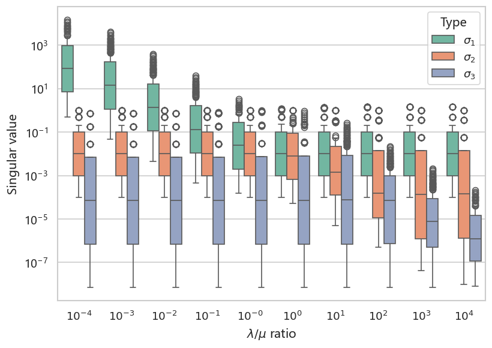

*图 1. 第一类系统参数扫描奇异值谱箱型图。用于说明不同参数组合下谱分离的强弱。*

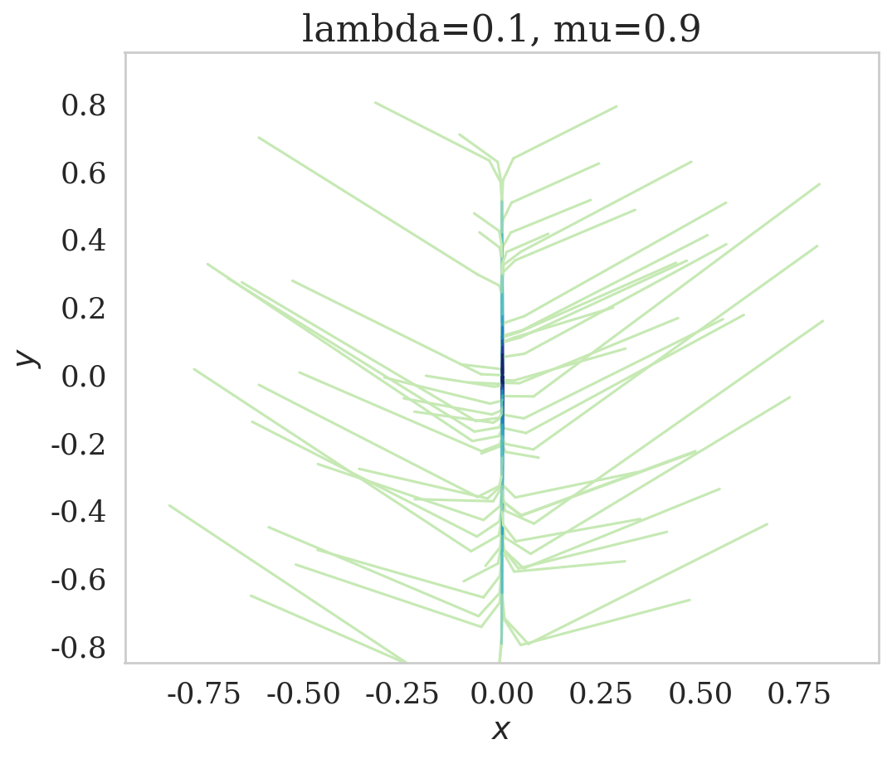

*图 2. 第一类系统固定参数轨迹相图。用于展示该系统在状态空间中的主收缩结构。*

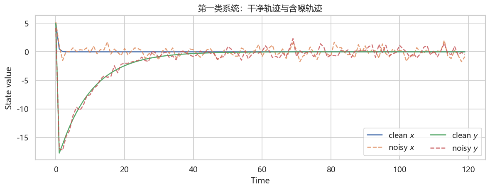

*图 3. 干净轨迹与含噪轨迹对比图。用于说明第三部分噪音加入的位置和强度。*

### 3. 计算指标的介绍（公式可交叉引用）
本实验沿用附录 C 与附录 D 的统一符号体系。观测层和宏观层分别满足
$$
o_{t+\tau}\approx A_o o_t + \varepsilon_t^{(o)},
\qquad
z_{t+\tau}\approx A_z z_t + \varepsilon_t^{(z)}.
$$
其中第三部分采用真值版本：`A_o` 直接由解析动力学给定，`\Sigma_o` 由观测层噪音协方差直接给定；宏观层则由
$$
A_z = W A_o W^\top,
\qquad
\Sigma_z = W \Sigma_o W^\top
$$
得到。实验中使用的核心指标包括：

1. 近似可逆性
$$
\Gamma_\alpha^{\mathrm{GIS}}(A,\Sigma).
$$
2. 对数近似可逆性
$$
\log \Gamma_\alpha^{\mathrm{GIS}}(A,\Sigma).
$$
3. 维度平均近似可逆性（维度平均效率）
$$
J_\alpha^{\mathrm{GIS}}(A,\Sigma;d)=\frac{1}{d}\log \Gamma_\alpha^{\mathrm{GIS}}(A,\Sigma).
$$
4. 确定性
$$
D(\Sigma)=\log\operatorname{pdet}(\Sigma^{-1}).
$$
5. 非简并性
$$
N(A,\Sigma)=\log\operatorname{pdet}(A^\top\Sigma^{-1}A).
$$
6. 因果涌现强度
$$
CE = \Delta J_\alpha = J_{\alpha,z}-J_{\alpha,o}.
$$
7. 预测误差，包括单步误差与多步滚动误差。例如单步误差定义为
$$
E_1 = \frac{1}{T}\sum_t \|x_{t+\tau}-\hat x_{t+\tau|t}\|^2.
$$

此外，第三部分中用于构造粗粒化矩阵 $W$ 的核心步骤是完整两步 SVD 法：先分别对
$$
\Sigma_o^{-1}
\qquad \text{和} \qquad
A_o^\top \Sigma_o^{-1}A_o
$$
做 SVD，再将两组奇异值合并排序、按阈值 `\epsilon` 截断，随后对组合矩阵 $\bar U\bar S$ 再做一次 SVD，并按 `\epsilon` 或手动维数确定最终的 $W$。

### 4. 实验结果图（配图）
第二部分先给出解析矩阵级结果：

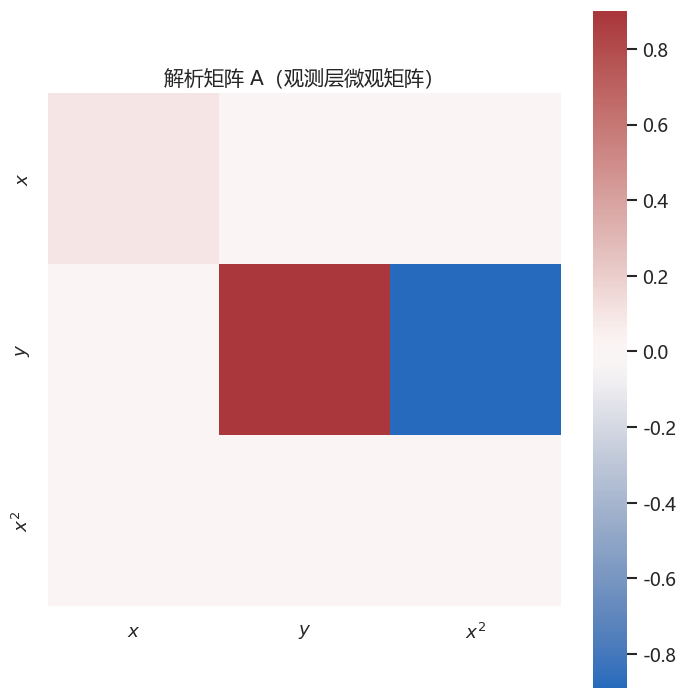

*图 4. 第二部分解析矩阵 $A$ 热力图。用于展示已知确定动力学在观测层的线性结构。*

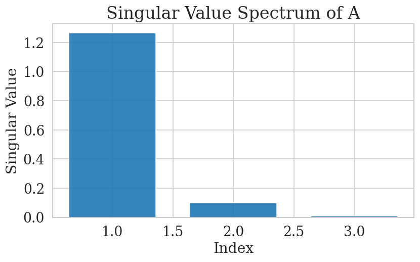

*图 5. 第二部分解析矩阵奇异值谱图。用于观察矩阵级谱分离和主方向强度。*

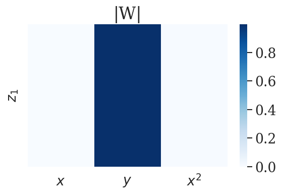

*图 6. 第二部分由解析矩阵直接构造得到的粗粒化矩阵 $W$ 热力图。*

第三部分重点给出完整两步 SVD 的核心图：

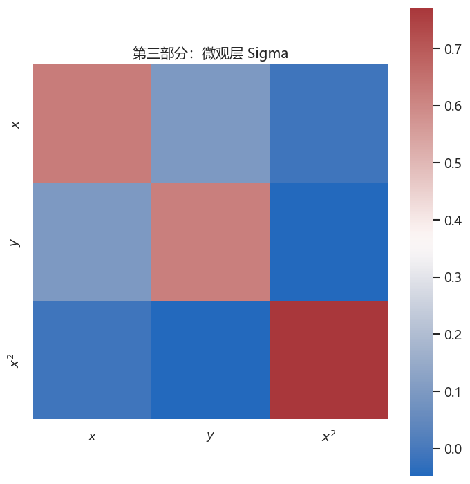

*图 7. 第三部分观测层协方差矩阵 $\Sigma_o$ 热力图。该矩阵由观测层噪音样本直接构造。*

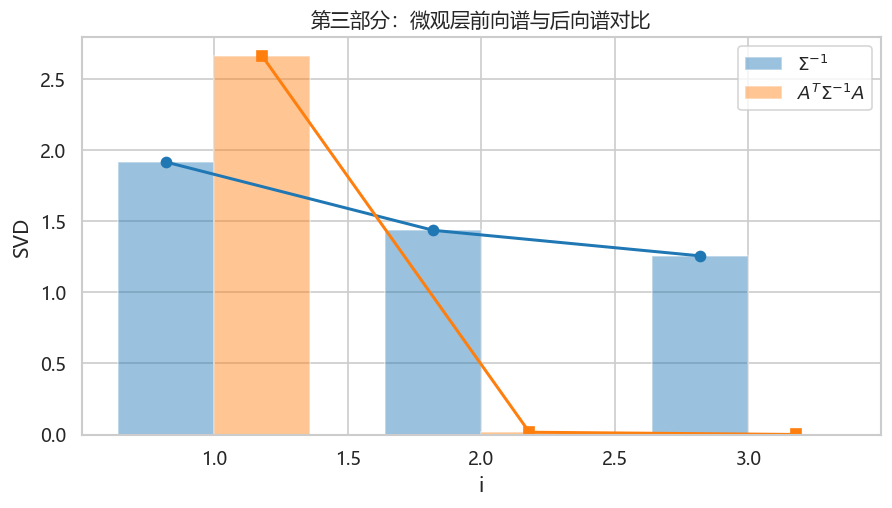

*图 7-1. 第三部分观测层奇异值谱。*

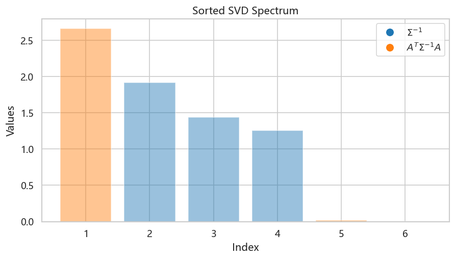

*图 7-2. 第三部分观测层奇异值谱。*

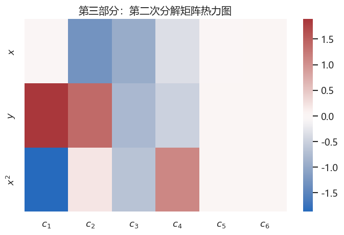

*图 8. 完整两步 SVD 中第二次分解矩阵 $\bar U\bar S$ 的热力图。它对应第一次截断后保留方向的加权组合。*

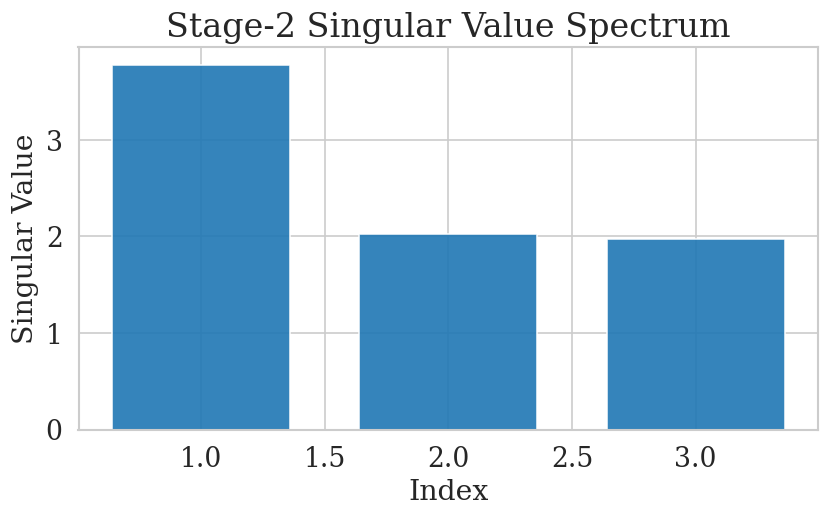

*图 9. 完整两步 SVD 中第二次分解的奇异值谱图。用于说明最终宏观维数如何由第二次截断确定。*

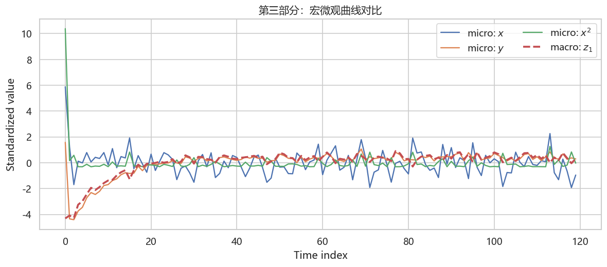

*图 10. 第三部分宏微观曲线对比图。用于观察一维宏观变量是否保留了微观层主要动力学趋势。*

第四部分给出 `step2` 系统上的方法对照图：

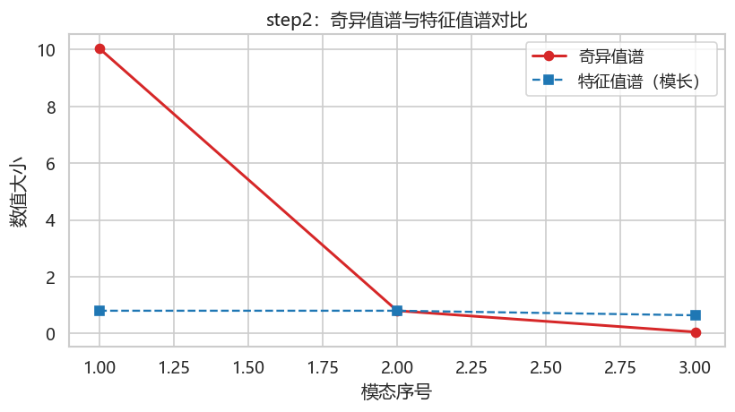

*图 11. `step2` 系统奇异值谱与特征值谱对比图。说明 SVD 与 EVD 强调的结构层面不同。*

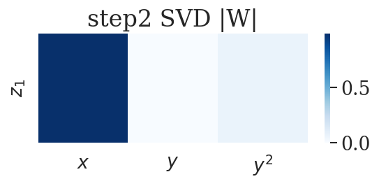

*图 12. `step2` 系统中 SVD 路线得到的粗粒化矩阵 $W$。*

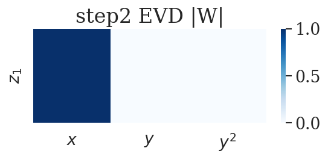

*图 13. `step2` 系统中 EVD 路线得到的粗粒化矩阵 $W$。*

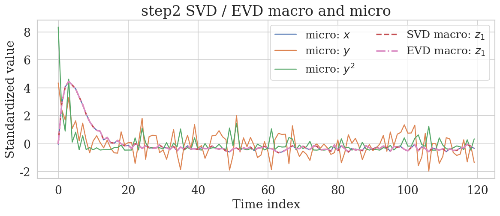

*图 14. `step2` 系统中 SVD / EVD 宏微观曲线对比图。用于观察两种方法产生的宏观变量差异。*

为了进一步贴近 Liu 2025 中以
$\mathbf{A}^{\top}\boldsymbol{\Sigma}^{-1}\mathbf{A}$
刻画后向非简并结构的做法，下面单独考察该后向精度矩阵的奇异值谱与奇异向量，而不混入
$\boldsymbol{\Sigma}^{-1}$
的前向确定性方向，也不执行完整两步 SVD 的第二次分解。

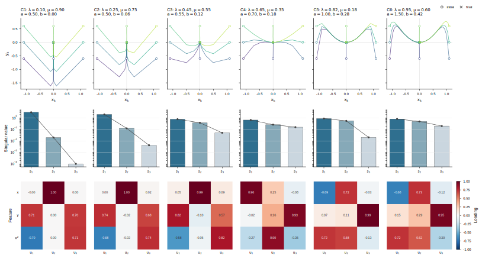

*图 15. 不同参数组合下的相图轨迹、后向精度矩阵 $\mathbf{A}^{\top}\boldsymbol{\Sigma}^{-1}\mathbf{A}$ 的奇异值谱，以及对应左奇异向量。每一列对应一个参数组合；第一行给出二维状态空间中的轨迹形态，第二行给出后向精度矩阵的三个奇异值，第三行给出左奇异向量在 $x$、$y$、$x^2$ 三个观测方向上的载荷。*

### 5. 实验结果解释（定量，图上的要素都要介绍到）
本实验的关键定量结果如下。

#### 5.1 第一部分：参数扫描的定性解释
第一部分没有直接计算 `CE`，其作用是为后续实验提供谱结构背景。图 1 中，不同参数组合对应的奇异值箱型图显示第一类系统在部分参数范围内会出现明显的谱分离；图 2 中，固定参数 `\lambda=0.1`、`\mu=0.9` 下的轨迹相图则显示系统在相空间中具有明显收缩与组织结构。这意味着从谱和轨迹两方面看，都存在提取低维宏观主方向的可能性。

#### 5.2 第二部分：解析矩阵实验
第二部分在直接给定解析矩阵 `A` 的条件下，得到如下谱驱动结果：
- `Gamma_alpha_K = 1.372871`
- `gamma_alpha_K = 0.457624`
- `selected_r = 1`
- `direct_CE = 0.808137`

图 4 展示了解析矩阵本身的耦合结构，图 5 给出了矩阵级奇异值谱，图 6 则显示最终粗粒化矩阵主要由哪几个观测方向构成。这里的 `CE` 不来自 `GIS(A,\Sigma)` 的结构指标，而是来自解析矩阵奇异值谱的矩阵级比较。结果说明，即使不引入噪音协方差矩阵，单从已知解析矩阵的主方向结构出发，也能观察到明显正的宏观增益。

#### 5.3 第三部分：已知真值 `A` 与真值 `\Sigma` 的 `GIS` 验证实验
第三部分采用真值动力学矩阵与观测层真值协方差矩阵，得到如下结果：
- 微观层一步与多步平均误差：`E_1 = 3.875928`，`E_3 = 3.422716`，`E_5 = 3.053740`
- 宏观层一步与多步平均误差：`E_1 = 1.371418`，`E_3 = 1.352912`，`E_5 = 1.422262`
- 微观层：`J_alpha = -0.962456`，`D = 1.238378`，`N = -12.787854`，`log_Gamma = -2.887369`
- 宏观层：`J_alpha = 0.157634`，`D = 0.346978`，`N = 0.283557`，`log_Gamma = 0.157634`
- 最终 `CE = 1.120090`
- 完整两步 SVD 第二次截断后的宏观维度：`r = 1`
- 第二次分解奇异值谱：`[3.032064, 1.767575, 1.434397]`
- 最终粗粒化矩阵：`W = [-0.115062, 0.769845, -0.627773]`

图 3 中干净轨迹与带噪轨迹的偏离说明原始状态层噪音已经显著传到观测层，因此这里用观测层差值直接构造 `\Sigma_o` 是必要的。图 7 的协方差矩阵热力图给出了观测层噪音在三个观测变量之间的相关结构，它不是一个简单的对角阵，这也是采用观测层协方差而不是原始噪音协方差的原因。图 8 的 $\bar U\bar S$ 热力图对应完整两步 SVD 中第二次分解的输入矩阵，展示了第一次截断后保留下来的主方向已经形成明显加权结构。图 9 中，第二次分解奇异值谱的第一奇异值明显大于后两项，解释了为什么最终第二次截断后只保留了一个宏观方向。图 10 中的宏微观曲线对比进一步说明，最终宏观变量并不是单纯对应于某一个观测坐标，而是能够稳定跟随微观层的主变化趋势。

定量上看，这一部分最重要的结论有两点。第一，尽管宏观层把维度从 3 压缩到 1，但 `J_alpha` 从 `-0.962456` 提升到 `0.157634`，从而得到 `CE = 1.120090` 的正增益，说明完整两步 SVD 法确实提取出了更高效的低维表示。第二，宏观层的预测误差整体低于微观层，说明这里的粗粒化并不是靠牺牲动力学闭合性换取结构指标的改善，而是在结构和预测两方面都获得了更稳的表现。

#### 5.4 第四部分：`step2` 系统下 SVD 与 EVD 的差异
第四部分在 `step2` 系统上得到如下矩阵级结果：
- SVD 路线：`micro_channel_mean = 3.634383`，`selected_r = 1`，`macro_top_singular = 1.432740`，`CE = 6.417831`
- EVD 路线：`micro_channel_mean = 0.746667`，`selected_r = 1`，`macro_top_singular = 0.800000`，`CE = 0.053333`

图 11 表明奇异值谱与特征值谱在 `step2` 系统上并不一致，说明两种分解强调的结构层面不同。图 12 与图 13 进一步把这种差异具体化为不同的粗粒化矩阵，也就是不同的宏观方向选择。图 14 则显示 SVD 与 EVD 产生的宏观曲线明显不同。当前结果虽然两条路线都得到正值，但 SVD 的增益远强于 EVD，说明在这个非正交耦合明显的系统里，SVD 更能抓住主伸缩方向。

#### 5.5 后向精度矩阵的参数组谱分析
图 15 的目的不是重新计算完整 `CE`，而是单独回答一个更局部的问题：如果只按照 Liu 2025 中的后向非简并结构，观察矩阵
$\mathbf{B}:=\mathbf{A}^{\top}\boldsymbol{\Sigma}^{-1}\mathbf{A}$，
那么不同动力学参数与噪声协方差结构会怎样改变可分辨方向。

从奇异值谱看，`C1` 和 `C2` 具有最强的低秩特征。`C1` 的三个奇异值约为
`[3.2043, 0.0200, 0.0001]`，`C2` 约为
`[2.0739, 0.1269, 0.0042]`，第一奇异值远大于后两项，说明后向可分辨能力集中在一个主方向上。对应的左奇异向量主要落在 $y$ 与 $x^2$ 的组合上，而 $x$ 方向更多出现在第二奇异向量中。这与相图中强收缩、轨迹快速汇聚到低维形态的现象一致：许多初始差异经过动力学后被压缩，真正保留下来的后向可区分结构主要是一条混合方向。

当参数进入 `C3` 和 `C4`，谱分离明显减弱。`C3` 的奇异值约为
`[0.7948, 0.3883, 0.0514]`，`C4` 约为
`[0.6760, 0.2647, 0.1612]`。这说明后向非简并结构不再由单一方向完全主导，而是开始分布到两个甚至三个方向。左奇异向量也显示出从 $y$-$x^2$ 混合方向向 $x$ 方向转移的趋势：在 `C4` 中第一奇异向量已经主要由 $x$ 分量贡献。这表明随着 $\lambda$ 增大、$\mu$ 减小，$x$ 方向在后向分辨中变得更重要。

`C5` 与 `C6` 则表现为另一类结构：相图中轨迹不再只是快速收缩到原点附近，而是保留更明显的弯曲形态；谱上第一、第二奇异值更接近，`C6` 的第三奇异值也上升到约 `0.2016`。这意味着系统的后向可分辨信息不再适合用一个单独方向概括。对应的左奇异向量中，$x$ 与 $x^2$ 分量同时增强，并与 $y$ 方向共同参与主方向构成，说明非简并性方向已经从早期的 $y$-$x^2$ 主导转向更混合的观测空间结构。

因此，图 15 支持一个更具体的解释：$\mathbf{A}^{\top}\boldsymbol{\Sigma}^{-1}\mathbf{A}$ 的奇异值谱不仅给出“后向可分辨性强弱”，还给出“后向可分辨性集中在哪些观测方向”。当谱高度分离时，宏观粗粒化更容易选择一个稳定的一维主方向；当谱趋于平缓时，单一宏观维度可能不足以保留全部后向非简并结构，需要结合谱间隙、预测闭合性和维度平均效率共同判断宏观维数。这也解释了为什么完整框架不能只看 $\mathbf{A}$ 或只看 $\boldsymbol{\Sigma}$，而需要把动力学映射与噪声精度通过 $\mathbf{A}^{\top}\boldsymbol{\Sigma}^{-1}\mathbf{A}$ 合并考察。

### 6. 实验结论（定性，包括是否符合实验预期）
本实验总体上**符合实验预期**，而且比旧版结果更清楚地支持了当前研究框架的三个核心判断：

1. 对于已知解析动力学，直接给定真值 `A` 与真值观测层协方差 `\Sigma` 后，第三部分仍然得到显著正的 `CE = 1.120090`，说明“宏观层单位维度效率更高”不是由回归误差偶然造成的，而是系统结构本身支持的结果。
2. 完整两步 SVD 法比简化版更符合论文中的算法叙事：它先分别提取确定性与非简并性方向，再统一排序、截断并再次分解，最终得到的一维宏观变量既有正的结构增益，又有更低的预测误差，因此方法学上更加自洽。
3. `step2` 系统的对照实验继续说明，粗粒化矩阵 `W` 的构造方式会显著影响最终结果。即使在本次更新后的结果里，EVD 也只给出很小的 `CE`，而 SVD 仍然给出远高于 EVD 的增益，这为把 SVD 作为默认宏观方向提取方法提供了直接支持。
4. 从交付链条来看，本实验现在已经形成了更完整的验证路径：参数扫描提供背景，解析矩阵实验提供最简矩阵验证，第三部分提供真值 `GIS` 验证，第四部分提供 SVD / EVD 方法对照。因此，这一实验可以作为后续更多系统复现实验和参数扫描实验的标准起点。

后续自然可扩展的方向包括：对 `\tau`、噪声强度、阈值 `\epsilon` 和手动宏观维度 `r` 做系统扫描；把当前单轨迹实验扩展为多初值、多轨迹统计；以及在更多非正交系统上继续检验完整两步 SVD 法相对其他宏观构造方法的稳定优势。

### 噪音实验
# 第三部分噪音强度扫描实验

## 实验设置

- 扫描对象：第三部分含噪实验的 `noise_scale`
- 噪音取值：0.050, 0.100, 0.200, 0.400, 0.800, 1.200, 1.600
- 固定参数：`lam=0.1`，`mu=0.9`，`tau=1`，`alpha=1.0`，`manual_r=1`，`horizons=(1, 3, 5)`

## 汇总图

## 结果结论

- `CE` 随噪音变化的总体趋势为：整体上升。
- `CE` 最大值出现在 `noise_scale=0.800`，此时 `CE=1.120090`。
- `CE` 最小值出现在 `noise_scale=0.100`，此时 `CE=-1.384853`。
- 微观和宏观单步误差都随噪音增大而上升。
- 是否出现“因果涌现”以 `CE > 0`、宏观 `J_alpha` 高于微观 `J_alpha`，且宏观预测误差没有明显恶化为主要判断依据。

## 数值汇总

| noise_scale | micro_dim | macro_dim | selected_r | CE | micro_J_alpha | macro_J_alpha | micro_D | micro_N | macro_D | macro_N | micro_E1 | macro_E1 | micro_E3 | macro_E3 | micro_E5 | macro_E5 |
| --- | --- | --- | --- | --- | --- | --- | --- | --- | --- | --- | --- | --- | --- | --- | --- | --- |
| 0.050000 | 3.000000 | 1.000000 | 1.000000 | -0.525263 | 2.488682 | 1.963419 | 21.945207 | 7.918976 | 9.881156 | -2.027481 | 0.006991 | 0.000183 | 0.006482 | 0.000145 | 0.005793 | 0.000100 |
| 0.100000 | 3.000000 | 1.000000 | 1.000000 | -1.384853 | 1.711758 | 0.326905 | 17.283661 | 3.257430 | 7.992240 | -6.684620 | 0.028374 | 0.000607 | 0.026257 | 0.000527 | 0.023480 | 0.000434 |
| 0.200000 | 3.000000 | 1.000000 | 1.000000 | -1.284557 | 0.858276 | -0.426281 | 12.162773 | -1.863459 | 5.643086 | -7.348210 | 0.119801 | 0.004775 | 0.110251 | 0.004680 | 0.098661 | 0.004584 |
| 0.400000 | 3.000000 | 1.000000 | 1.000000 | 0.385329 | -0.043639 | 0.341690 | 6.751279 | -7.274953 | 2.958284 | -1.591526 | 0.577988 | 0.091434 | 0.524123 | 0.094385 | 0.469001 | 0.088832 |
| 0.800000 | 3.000000 | 1.000000 | 1.000000 | 1.120090 | -0.962456 | 0.157634 | 1.238378 | -12.787854 | 0.346978 | 0.283557 | 3.875928 | 1.371418 | 3.422716 | 1.352912 | 3.053740 | 1.422262 |
| 1.200000 | 3.000000 | 1.000000 | 1.000000 | 1.103121 | -1.502266 | -0.399145 | -2.000479 | -16.026711 | -0.815647 | -0.780935 | 14.560854 | 4.613466 | 12.668887 | 4.955246 | 11.269524 | 5.783243 |
| 1.600000 | 3.000000 | 1.000000 | 1.000000 | 1.031240 | -1.885627 | -0.854386 | -4.300644 | -18.326875 | -1.731353 | -1.686192 | 40.394559 | 11.526508 | 34.880778 | 12.153017 | 30.963253 | 14.079550 |

## 各噪音值结果

### noise_scale = 0.050

#### 图

#### 数值

- 微观 GIS 指标：`Gamma=1747.682354`，`log_Gamma=7.466046`，`J_alpha=2.488682`，`D=21.945207`，`N=7.918976`
- 宏观 GIS 指标：`Gamma=7.123641`，`log_Gamma=1.963419`，`J_alpha=1.963419`，`D=9.881156`，`N=-2.027481`
- CE：`-0.525263`
- 微观预测误差：`E1=0.006991`，`E3=0.006482`，`E5=0.005793`
- 宏观预测误差：`E1=0.000183`，`E3=0.000145`，`E5=0.000100`

### noise_scale = 0.100

#### 图

#### 数值

- 微观 GIS 指标：`Gamma=169.910657`，`log_Gamma=5.135273`，`J_alpha=1.711758`，`D=17.283661`，`N=3.257430`
- 宏观 GIS 指标：`Gamma=1.386670`，`log_Gamma=0.326905`，`J_alpha=0.326905`，`D=7.992240`，`N=-6.684620`
- CE：`-1.384853`
- 微观预测误差：`E1=0.028374`，`E3=0.026257`，`E5=0.023480`
- 宏观预测误差：`E1=0.000607`，`E3=0.000527`，`E5=0.000434`

### noise_scale = 0.200

#### 图

#### 数值

- 微观 GIS 指标：`Gamma=13.129066`，`log_Gamma=2.574829`，`J_alpha=0.858276`，`D=12.162773`，`N=-1.863459`
- 宏观 GIS 指标：`Gamma=0.652933`，`log_Gamma=-0.426281`，`J_alpha=-0.426281`，`D=5.643086`，`N=-7.348210`
- CE：`-1.284557`
- 微观预测误差：`E1=0.119801`，`E3=0.110251`，`E5=0.098661`
- 宏观预测误差：`E1=0.004775`，`E3=0.004680`，`E5=0.004584`

### noise_scale = 0.400

#### 图

#### 数值

- 微观 GIS 指标：`Gamma=0.877289`，`log_Gamma=-0.130918`，`J_alpha=-0.043639`，`D=6.751279`，`N=-7.274953`
- 宏观 GIS 指标：`Gamma=1.407323`，`log_Gamma=0.341690`，`J_alpha=0.341690`，`D=2.958284`，`N=-1.591526`
- CE：`0.385329`
- 微观预测误差：`E1=0.577988`，`E3=0.524123`，`E5=0.469001`
- 宏观预测误差：`E1=0.091434`，`E3=0.094385`，`E5=0.088832`

### noise_scale = 0.800

#### 图

#### 数值

- 微观 GIS 指标：`Gamma=0.055723`，`log_Gamma=-2.887369`，`J_alpha=-0.962456`，`D=1.238378`，`N=-12.787854`
- 宏观 GIS 指标：`Gamma=1.170737`，`log_Gamma=0.157634`，`J_alpha=0.157634`，`D=0.346978`，`N=0.283557`
- CE：`1.120090`
- 微观预测误差：`E1=3.875928`，`E3=3.422716`，`E5=3.053740`
- 宏观预测误差：`E1=1.371418`，`E3=1.352912`，`E5=1.422262`

### noise_scale = 1.200

#### 图

#### 数值

- 微观 GIS 指标：`Gamma=0.011034`，`log_Gamma=-4.506798`，`J_alpha=-1.502266`，`D=-2.000479`，`N=-16.026711`
- 宏观 GIS 指标：`Gamma=0.670893`，`log_Gamma=-0.399145`，`J_alpha=-0.399145`，`D=-0.815647`，`N=-0.780935`
- CE：`1.103121`
- 微观预测误差：`E1=14.560854`，`E3=12.668887`，`E5=11.269524`
- 宏观预测误差：`E1=4.613466`，`E3=4.955246`，`E5=5.783243`

### noise_scale = 1.600

#### 图

#### 数值

- 微观 GIS 指标：`Gamma=0.003493`，`log_Gamma=-5.656880`，`J_alpha=-1.885627`，`D=-4.300644`，`N=-18.326875`
- 宏观 GIS 指标：`Gamma=0.425544`，`log_Gamma=-0.854386`，`J_alpha=-0.854386`，`D=-1.731353`，`N=-1.686192`
- CE：`1.031240`
- 微观预测误差：`E1=40.394559`，`E3=34.880778`，`E5=30.963253`
- 宏观预测误差：`E1=11.526508`，`E3=12.153017`，`E5=14.079550`
