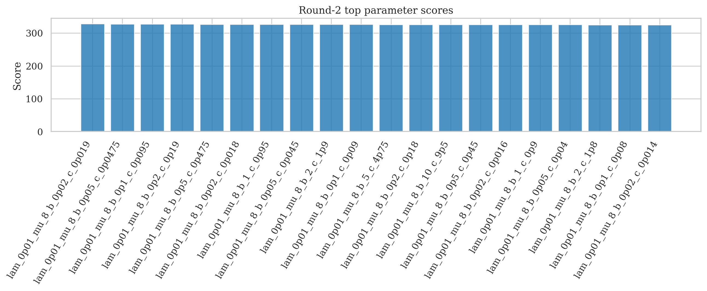
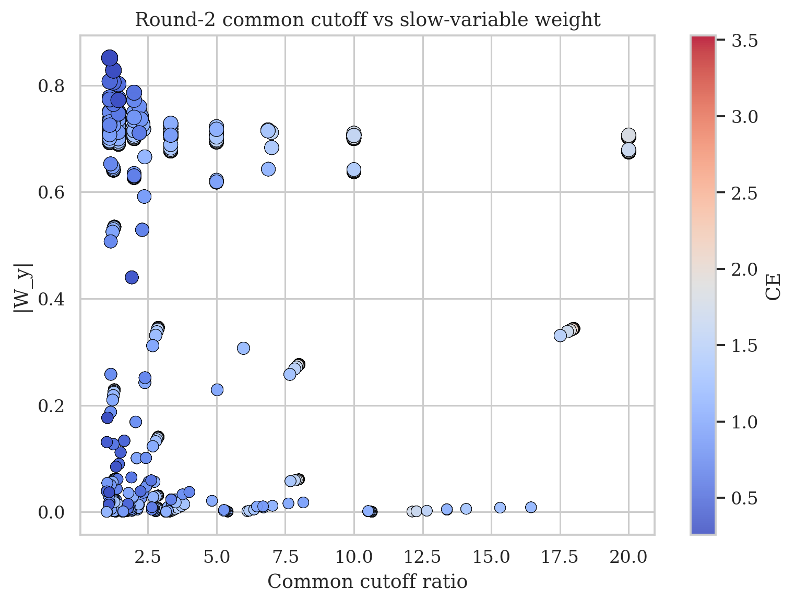
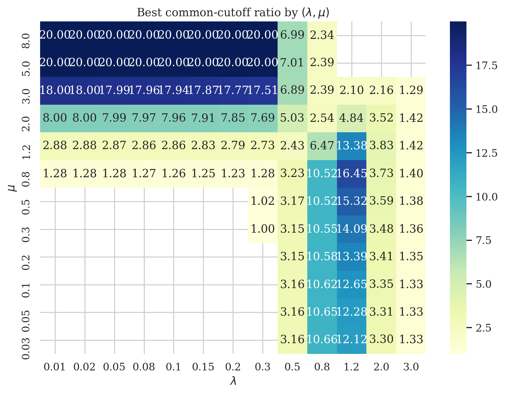
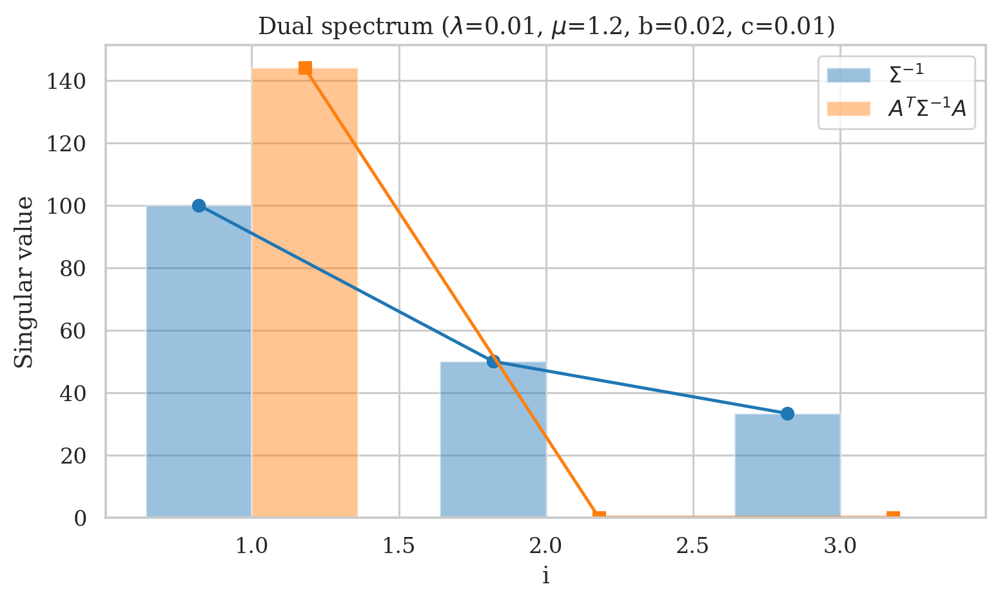
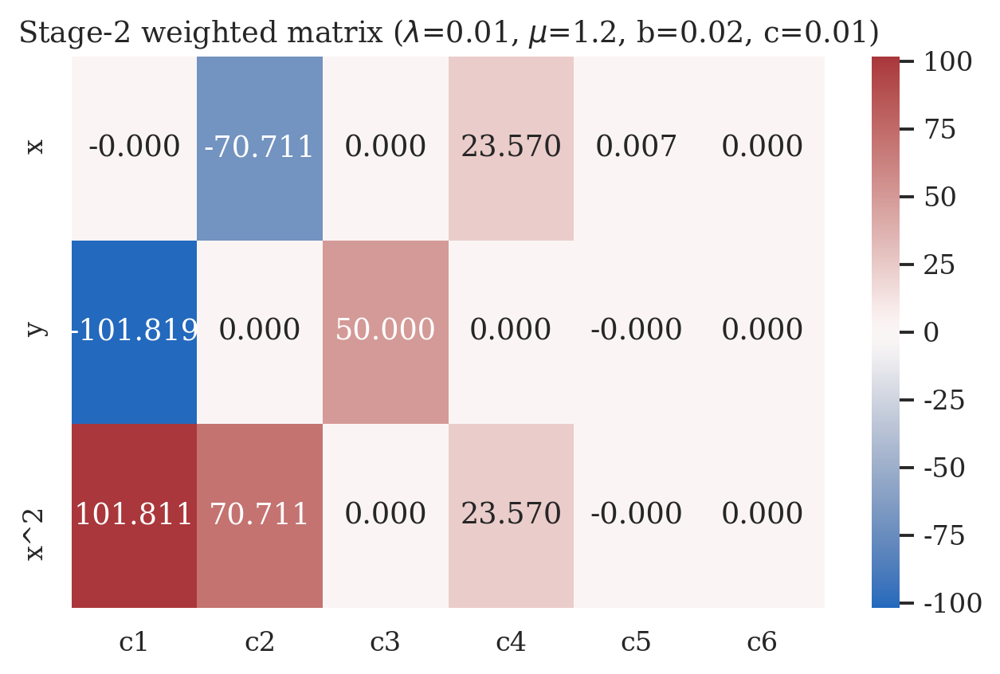
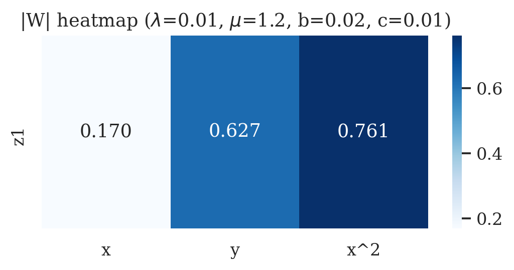
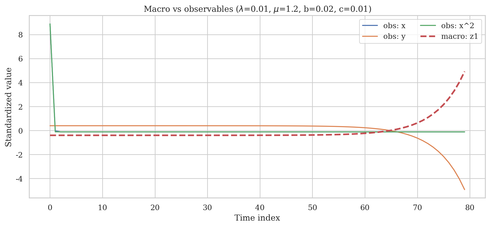
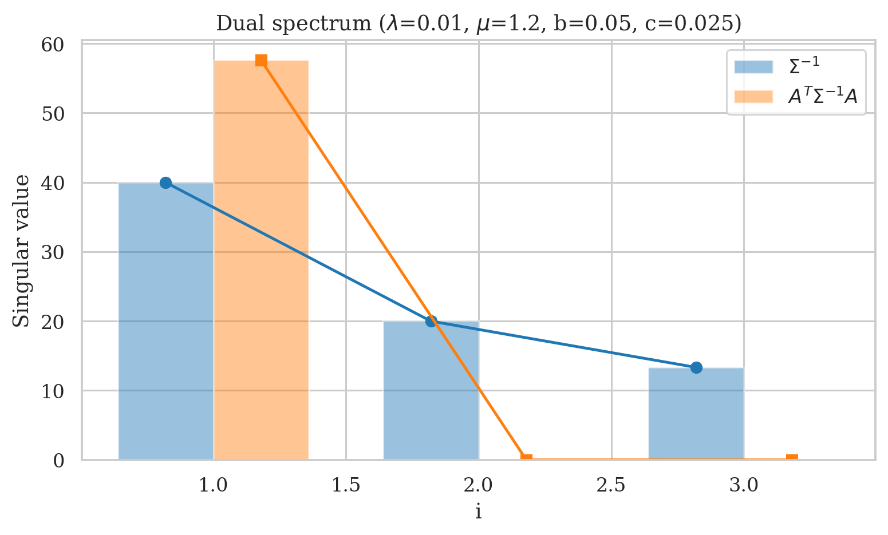
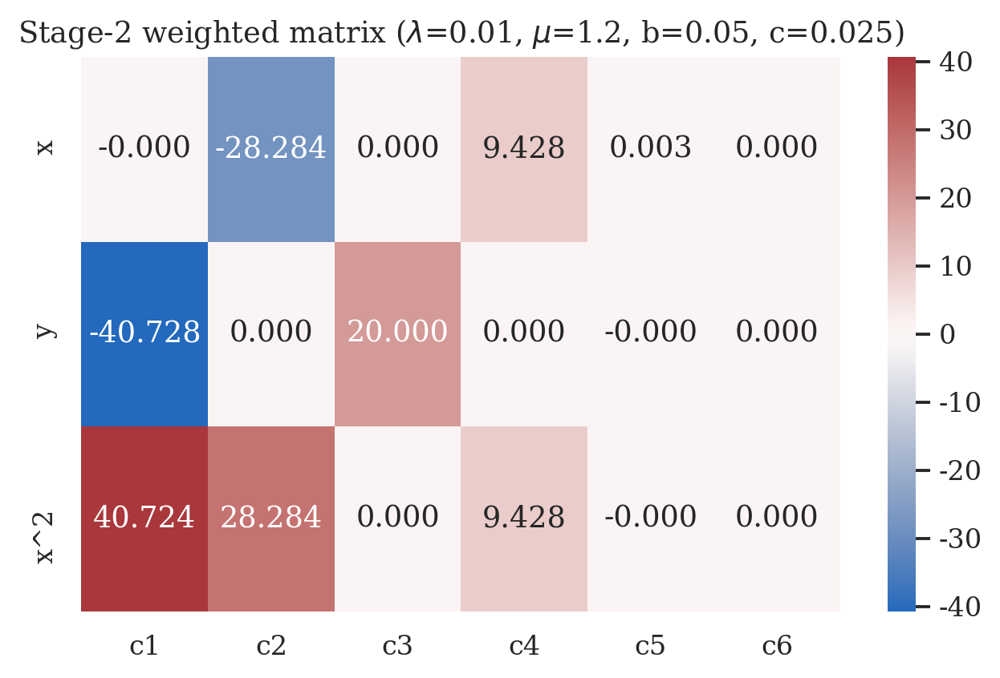

# 参数实验第二次

第二次参数实验继续扩大 `lam / mu / b / c` 的搜索范围，并使用新的评价口径：

- 不再预设某个固定截断阈值，而是直接判断两个矩阵是否存在共同截断线。
- 共同截断线存在的条件为：

  `max(σ2(Σ^{-1}), σ2(A^T Σ^{-1} A)) < min(σ1(Σ^{-1}), σ1(A^T Σ^{-1} A))`

- 当上式成立时，就说明两个矩阵都能被同一条线截成 1 维。
- 在共同截断线基础上，再观察 `W` 是否偏向慢变量 `y`，以及 `CE` 是否较高。

- 共评估参数组数：`12096`。
- 存在共同截断线的参数组数：`5364`。

## 汇总图

## 共同截断线最强的参数

| lam | mu | b | c | common_cut_low | common_cut_high | common_cut_ratio | w_abs_x | w_abs_y | w_abs_x2 | w_y_ratio | ce | score |
| --- | --- | --- | --- | --- | --- | --- | --- | --- | --- | --- | --- | --- |
| 0.010000 | 8.000000 | 0.020000 | 0.019000 | 49.999999 | 999.999800 | 19.999996 | 0.008731 | 0.702721 | 0.711412 | 0.987784 | 3.529965 | 328.152306 |
| 0.010000 | 8.000000 | 0.050000 | 0.047500 | 20.000000 | 399.999968 | 19.999998 | 0.008731 | 0.702721 | 0.711412 | 0.987784 | 3.529965 | 327.833955 |
| 0.010000 | 8.000000 | 0.100000 | 0.095000 | 10.000000 | 199.999992 | 19.999999 | 0.008731 | 0.702721 | 0.711412 | 0.987784 | 3.529965 | 327.593131 |
| 0.010000 | 8.000000 | 0.200000 | 0.190000 | 5.000000 | 99.999998 | 20.000000 | 0.008731 | 0.702721 | 0.711412 | 0.987784 | 3.529965 | 327.352307 |
| 0.010000 | 8.000000 | 0.500000 | 0.475000 | 2.000000 | 40.000000 | 20.000000 | 0.008731 | 0.702721 | 0.711412 | 0.987784 | 3.529965 | 327.033955 |
| 0.010000 | 8.000000 | 0.020000 | 0.018000 | 50.000000 | 499.999950 | 9.999999 | 0.002158 | 0.706045 | 0.708164 | 0.997008 | 3.467874 | 326.997145 |
| 0.010000 | 8.000000 | 1.000000 | 0.950000 | 1.000000 | 20.000000 | 20.000000 | 0.008731 | 0.702721 | 0.711412 | 0.987784 | 3.529965 | 326.793131 |
| 0.010000 | 8.000000 | 0.050000 | 0.045000 | 20.000000 | 199.999992 | 10.000000 | 0.002158 | 0.706045 | 0.708164 | 0.997008 | 3.467874 | 326.678793 |
| 0.010000 | 8.000000 | 2.000000 | 1.900000 | 0.500000 | 10.000000 | 20.000000 | 0.008731 | 0.702721 | 0.711412 | 0.987784 | 3.529965 | 326.552307 |
| 0.010000 | 8.000000 | 0.100000 | 0.090000 | 10.000000 | 99.999998 | 10.000000 | 0.002158 | 0.706045 | 0.708164 | 0.997008 | 3.467874 | 326.437969 |
| 0.010000 | 8.000000 | 5.000000 | 4.750000 | 0.200000 | 4.000000 | 20.000000 | 0.008731 | 0.702721 | 0.711412 | 0.987784 | 3.529965 | 326.233955 |
| 0.010000 | 8.000000 | 0.200000 | 0.180000 | 5.000000 | 49.999999 | 10.000000 | 0.002158 | 0.706045 | 0.708164 | 0.997008 | 3.467874 | 326.197145 |
| 0.010000 | 8.000000 | 10.000000 | 9.500000 | 0.100000 | 2.000000 | 20.000000 | 0.008731 | 0.702721 | 0.711412 | 0.987784 | 3.529965 | 325.993131 |
| 0.010000 | 8.000000 | 0.500000 | 0.450000 | 2.000000 | 20.000000 | 10.000000 | 0.002158 | 0.706045 | 0.708164 | 0.997008 | 3.467874 | 325.878793 |
| 0.010000 | 8.000000 | 0.020000 | 0.016000 | 49.999999 | 249.999988 | 5.000000 | 0.000533 | 0.706859 | 0.707354 | 0.999301 | 3.401100 | 325.835033 |
| 0.010000 | 8.000000 | 1.000000 | 0.900000 | 1.000000 | 10.000000 | 10.000000 | 0.002158 | 0.706045 | 0.708164 | 0.997008 | 3.467874 | 325.637969 |
| 0.010000 | 8.000000 | 0.050000 | 0.040000 | 20.000000 | 99.999998 | 5.000000 | 0.000533 | 0.706859 | 0.707354 | 0.999301 | 3.401100 | 325.516681 |
| 0.010000 | 8.000000 | 2.000000 | 1.800000 | 0.500000 | 5.000000 | 10.000000 | 0.002158 | 0.706045 | 0.708164 | 0.997008 | 3.467874 | 325.397145 |
| 0.010000 | 8.000000 | 0.100000 | 0.080000 | 10.000000 | 50.000000 | 5.000000 | 0.000533 | 0.706859 | 0.707354 | 0.999301 | 3.401100 | 325.275857 |
| 0.010000 | 8.000000 | 0.020000 | 0.014000 | 49.999999 | 166.666661 | 3.333333 | 0.000232 | 0.707009 | 0.707204 | 0.999724 | 3.357785 | 325.153230 |

## 更偏向慢变量 y 的共同截断参数

| lam | mu | b | c | common_cut_ratio | w_abs_x | w_abs_y | w_abs_x2 | w_y_ratio | ce | score |
| --- | --- | --- | --- | --- | --- | --- | --- | --- | --- | --- |
| 0.800000 | 1.200000 | 0.020000 | 0.002000 | 1.111111 | 0.058302 | 0.851107 | 0.521744 | 1.631273 | 0.258955 | 3.515759 |
| 0.800000 | 1.200000 | 0.050000 | 0.005000 | 1.111111 | 0.058302 | 0.851107 | 0.521744 | 1.631273 | 0.258955 | 3.197407 |
| 0.800000 | 1.200000 | 0.100000 | 0.010000 | 1.111111 | 0.058302 | 0.851107 | 0.521744 | 1.631273 | 0.258955 | 2.956583 |
| 0.800000 | 1.200000 | 0.200000 | 0.020000 | 1.111111 | 0.058302 | 0.851107 | 0.521744 | 1.631273 | 0.258955 | 2.715759 |
| 0.800000 | 1.200000 | 0.500000 | 0.050000 | 1.111111 | 0.058302 | 0.851107 | 0.521744 | 1.631273 | 0.258955 | 2.397407 |
| 0.800000 | 1.200000 | 1.000000 | 0.100000 | 1.111111 | 0.058302 | 0.851107 | 0.521744 | 1.631273 | 0.258955 | 2.156583 |
| 0.800000 | 1.200000 | 2.000000 | 0.200000 | 1.111111 | 0.058302 | 0.851107 | 0.521744 | 1.631273 | 0.258955 | 2.119977 |
| 0.800000 | 1.200000 | 5.000000 | 0.500000 | 1.111111 | 0.058302 | 0.851107 | 0.521744 | 1.631273 | 0.258955 | 2.119977 |
| 0.800000 | 1.200000 | 10.000000 | 1.000000 | 1.111111 | 0.058302 | 0.851107 | 0.521744 | 1.631273 | 0.258955 | 2.119977 |
| 0.800000 | 1.200000 | 0.020000 | 0.004000 | 1.250000 | 0.129569 | 0.827994 | 0.545562 | 1.517689 | 0.284011 | 3.626789 |
| 0.800000 | 1.200000 | 0.050000 | 0.010000 | 1.250000 | 0.129569 | 0.827994 | 0.545562 | 1.517689 | 0.284011 | 3.308437 |
| 0.800000 | 1.200000 | 0.100000 | 0.020000 | 1.250000 | 0.129569 | 0.827994 | 0.545562 | 1.517689 | 0.284011 | 3.067613 |
| 0.800000 | 1.200000 | 0.200000 | 0.040000 | 1.250000 | 0.129569 | 0.827994 | 0.545562 | 1.517689 | 0.284011 | 2.826789 |
| 0.800000 | 1.200000 | 0.500000 | 0.100000 | 1.250000 | 0.129569 | 0.827994 | 0.545562 | 1.517689 | 0.284011 | 2.508437 |
| 0.800000 | 1.200000 | 1.000000 | 0.200000 | 1.250000 | 0.129569 | 0.827994 | 0.545562 | 1.517689 | 0.284011 | 2.267613 |
| 0.800000 | 1.200000 | 2.000000 | 0.400000 | 1.250000 | 0.129569 | 0.827994 | 0.545562 | 1.517689 | 0.284011 | 2.190085 |
| 0.800000 | 1.200000 | 5.000000 | 1.000000 | 1.250000 | 0.129569 | 0.827994 | 0.545562 | 1.517689 | 0.284011 | 2.190085 |
| 0.800000 | 1.200000 | 10.000000 | 2.000000 | 1.250000 | 0.129569 | 0.827994 | 0.545562 | 1.517689 | 0.284011 | 2.190085 |
| 0.800000 | 2.000000 | 0.020000 | 0.002000 | 1.111111 | 0.009117 | 0.807177 | 0.590239 | 1.367542 | 0.468113 | 3.767522 |
| 0.800000 | 2.000000 | 0.050000 | 0.005000 | 1.111111 | 0.009117 | 0.807177 | 0.590239 | 1.367542 | 0.468113 | 3.449170 |

## 已保存详细图的参数

### `lam_0p01_mu_1p2_b_0p02_c_0p01`

- 参数：`lam=0.01`, `mu=1.2`, `b=0.02`, `c=0.01`
- 共同截断线区间：`(49.999999, 99.999998)`
- 指标：`common_cut_ratio=2.0000`, `|W_y|=0.6265`, `CE=2.6620`

### `lam_0p01_mu_1p2_b_0p05_c_0p025`

- 参数：`lam=0.01`, `mu=1.2`, `b=0.05`, `c=0.025`
- 共同截断线区间：`(20.000000, 40.000000)`
- 指标：`common_cut_ratio=2.0000`, `|W_y|=0.6265`, `CE=2.6620`

